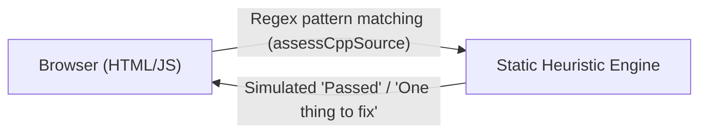
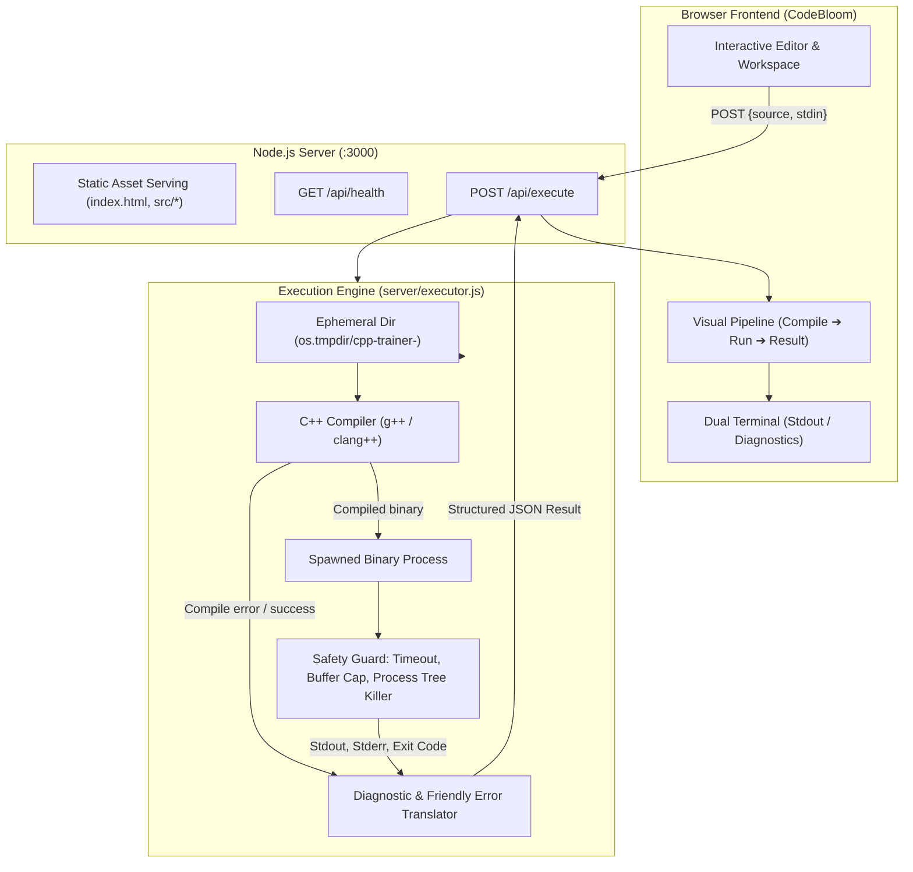
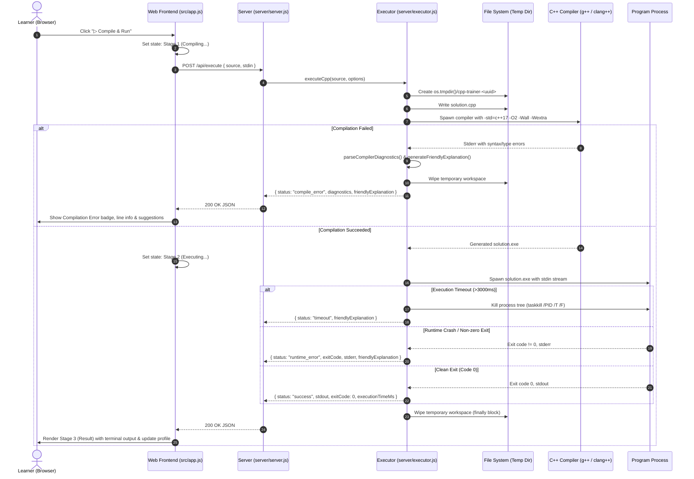

# Phase A Execution Report: Safe C++ Execution Pipeline & Assessment Foundation

## 1. Executive Summary

Phase A replaces the mock, regex-based source checking in the **CodeBloom C++ Trainer** with a real, safe, and robust C++ compilation and execution pipeline.

Learner code is compiled using a native C++ compiler (`g++` / `clang++` / `cl`), executed inside an ephemeral isolated workspace with strict execution bounds (timeout limits, buffer capping, process-tree termination), and reported back to the interactive frontend with structured diagnostics and beginner-friendly explanations.

---

## 2. Architecture Before vs. After Phase A

### Before Phase A

- **Execution Model**: Browser-only client with static hosting (`npx serve .`).
- **Code Assessment**: Weak source string inspection via regular expressions (`main(`, `#include <iostream>`, `cout`).
- **Deficiencies**:
  - Valid C++ code with minor stylistic variations could fail regex checks.
  - Invalid C++ code (e.g. invalid syntax, missing declarations, type errors, memory leaks) falsely passed.
  - Runtime errors, infinite loops, and actual standard output were never evaluated or executed.
  - Learners were deceived into thinking source analysis was real compilation.

---

### After Phase A


---

## 3. Files Created and Modified

| File | Status | Description |
|---|---|---|
| `server/executor.js` | **NEW** | Standalone C++ execution pipeline: compiler discovery, isolated workspace creation, compilation, process spawning, process-tree termination, output bounds, diagnostic parsing, and friendly error translation. |
| `server/server.js` | **NEW** | Built-in Node.js HTTP server serving static frontend files and API endpoints (`GET /api/health`, `POST /api/execute`). Zero external dependencies. |
| `tests/executor.test.js` | **NEW** | Comprehensive unit and integration test suite covering all 15 required execution and security scenarios. |
| `tests/server.test.js` | **NEW** | Server integration tests verifying static asset delivery, health check, payload limits, and execution API routes. |
| `docs/PHASE_A_EXECUTION_REPORT.md` | **NEW** | Self-contained, complete technical documentation and handoff specification. |
| `package.json` | **MODIFIED** | Added `npm start` and updated `npm run dev`, `npm test`, and `npm run build` scripts. |
| `src/learningEngine.js` | **MODIFIED** | Added `formatExecutionFeedback` to translate raw runner results into learner UI state; preserved learner profile, adaptive progression, and lesson navigation functions. Clarified static pre-check boundaries. |
| `src/app.js` | **MODIFIED** | Integrated execution API, 3-stage visual pipeline tracker (*Compile ➔ Run ➔ Result*), status badges, terminal output box, stdin toggle drawer for `cin`, and preserved all 20 lessons, practice, challenge, and mastery modes. |
| `src/style.css` | **MODIFIED** | Added styling for the execution tracker, status badges (Success, Compilation Error, Runtime Error, Timeout), terminal consoles (stdout vs stderr), and stdin drawer. |

---

## 4. Execution Flow & Architecture



---

## 5. API & Interface Contract

### `GET /api/health`
Returns the server status and compiler availability.
- **Response `200 OK`**:
```json
{
  "status": "ok",
  "compiler": {
    "available": true,
    "path": "C:\\Users\\...\\bin\\clang++.exe"
  },
  "platform": "win32",
  "nodeVersion": "v20.20.2"
}
```

### `POST /api/execute`
Compiles and executes C++ source code.
- **Request Body**:
```json
{
  "source": "#include <iostream>\nint main() { std::cout << \"Hello World!\"; return 0; }",
  "stdin": "optional input for cin",
  "timeoutMs": 3000,
  "compileTimeoutMs": 8000
}
```
- **Response Schema (`200 OK`)**:
```typescript
interface ExecutionResponse {
  status: "success" | "compile_error" | "runtime_error" | "timeout" | "execution_error";
  stdout: string;
  stderr: string;
  exitCode: number | null;
  executionTimeMs: number;
  diagnostics: Array<{
    line: number;
    column: number | null;
    severity: "error" | "warning" | "note";
    message: string;
    raw: string;
  }>;
  friendlyExplanation: string;
  truncated?: boolean;
}
```

---

## 6. Security Model & Untrusted Code Safeguards

Executing arbitrary C++ code presents significant security challenges. The Phase A implementation incorporates multiple defense layers:

1. **Child-Process Isolation**:
   - The main Node.js web server process NEVER runs C++ code directly in-process. All compilations and executions occur in isolated child processes with dedicated stdin/stdout/stderr pipes.
2. **Hard Timeout Enforcement**:
   - Compilations time out after 8,000 ms.
   - Program executions time out after 3,000 ms (configurable per request).
   - Timeouts trigger immediate termination of the process tree.
3. **Runaway Process Tree Termination**:
   - On Windows, `taskkill /PID <pid> /T /F` terminates the root process and all child processes spawned by it.
   - On POSIX platforms, `process.kill(-pid, 'SIGKILL')` sends kill signals to the process group.
4. **Buffer Flooding & Denial of Service Protection**:
   - Output streams are capped at 64 KB (`DEFAULT_MAX_OUTPUT_BYTES`).
   - If an infinite loop prints continuous output, the buffer stops accumulating data, preventing Node.js heap exhaustion.
   - Incoming JSON request payloads are capped at 512 KB (`MAX_BODY_BYTES`), returning HTTP 413 if exceeded.
5. **Filesystem Cleanup & Isolation**:
   - Every compilation and execution occurs in an ephemeral directory (`os.tmpdir()/cpp-trainer-<hex-id>`).
   - Workspaces are deleted in guaranteed `finally` blocks with fallback retries on Windows to handle brief file locks.
6. **Compiler Hardening Flags**:
   - `-std=c++17`: Modern, standard C++ semantics.
   - `-O2`: Optimization.
   - `-Wall -Wextra`: Comprehensive diagnostic warnings.
   - `-fdiagnostics-color=never`: Strips terminal escape codes for clean diagnostic parsing.

### Explicit Security Limitations (Local MVP vs. Production)
> [!WARNING]
> In this local MVP architecture, executed binaries run with the OS permissions of the local user launching `npm start`. While process timeouts, output capping, and file cleanup are strictly enforced, the process is not inside a hardware-isolated sandbox.
> 
> **For a production multi-tenant cloud environment**, the following infrastructure upgrades are required:
> - Containerized / microVM runners (e.g. **nsjail**, **gVisor / runsc**, or **Firecracker microVMs**).
> - Strict Linux `seccomp-bpf` syscall filtering disabling `fork`, `execve`, `socket`, `ptrace`.
> - Read-only root filesystem with `tmpfs` mounts sized to 16MB.
> - Network namespace isolation (`--net=none`) blocking all external socket calls.
> - Cgroups v2 limits: 64MB memory ceiling, 1 CPU core quota.

---

## 7. Test Suite & Verification Results

A comprehensive automated test suite was constructed in `tests/executor.test.js` and `tests/server.test.js`:

| # | Test Scenario | Category | Expected Behavior | Result |
|---|---|---|---|---|
| 1 | Valid hello-world program | Functionality | `status: "success"`, stdout matches | **PASS** |
| 2 | Valid input/output program (`cin`) | Stdin / Stdout | Reads stdin, computes sum, output matches | **PASS** |
| 3 | Syntax error | Compilation | `status: "compile_error"`, diagnostics populated | **PASS** |
| 4 | Missing semicolon | Diagnostics | Identifies error line and missing `;` | **PASS** |
| 5 | Undefined variable | Diagnostics | Identifies undeclared identifier | **PASS** |
| 6 | Runtime crash (null pointer) | Runtime Error | `status: "runtime_error"`, exit code non-zero | **PASS** |
| 7 | Division by zero | Runtime Error | Caught cleanly without server crash | **PASS** |
| 8 | Infinite loop (`while(true)`) | Timeout | Safely terminated after 1200ms | **PASS** |
| 9 | Large output flooding | Buffer Bound | Truncated at byte limit, memory safe | **PASS** |
| 10 | Non-zero exit code (`return 17`) | Runtime Error | Reported with code 17 | **PASS** |
| 11 | Empty source code | Input Validation | `status: "compile_error"` without spawning compiler | **PASS** |
| 12 | Malformed / binary junk source | Robustness | Handled safely, clean error report | **PASS** |
| 13 | Concurrent executions | Concurrency | 3 concurrent runs execute independently | **PASS** |
| 14 | Temporary directory cleanup | Resource Leak | Temp folders purged after run | **PASS** |
| 15 | Strict timeout enforcement | Resource Leak | Terminates thread sleep promptly | **PASS** |
| 16 | Health check API (`GET /api/health`) | Server | Returns JSON status and compiler info | **PASS** |
| 17 | Static file delivery | Server | Serves index.html, CSS, JS correctly | **PASS** |
| 18 | Directory traversal prevention | Security | Rejects traversal outside root directory | **PASS** |
| 19 | Invalid JSON payload handling | Server | Returns HTTP 400 Bad Request | **PASS** |
| 20 | Existing lesson navigation & progress | Regression | Lesson switching, adaptive difficulty preserved | **PASS** |

---

## 8. Commands to Run the System

### Start the Application
```bash
npm start
```
Starts the Node.js server at `http://localhost:3000`. Open this URL in any web browser.

### Run Automated Tests
```bash
npm test
```
Executes all unit tests, server integration tests, and execution engine tests using Node.js built-in test runner (`node:test`).

### Run Syntax and Build Checks
```bash
npm run build
```
Validates ES module syntax across all frontend and backend code files.

---

## 9. Environment & Dependency Requirements

- **Runtime**: Node.js v18+ (tested on Node.js v20.20.2). Zero external npm packages required for the core server and runner.
- **Compiler Toolchain**: Any standard C++ compiler accessible via system `PATH` or the `CPP_COMPILER` environment variable:
  - GCC (`g++`)
  - Clang (`clang++`)
  - MSVC (`cl.exe`)
  - LLVM MinGW / WinLibs on Windows

---

## 10. Known Non-Blocking Observations

1. On Windows, antivirus software (e.g. Windows Defender) may occasionally introduce a 200–400ms scan delay on the first launch of a freshly compiled `.exe` in `%TEMP%`.
2. Interactive programs requesting continuous conversational I/O (prompt ➔ response ➔ prompt) are currently tested via pre-supplied `stdin`. Live WebSocket-based interactive terminal streaming can be introduced in Phase B.

---

## 11. Recommended Phase B Work

1. **Automated Lesson Test Harness**:
   - Provide expected input/output test cases per lesson/exercise so the system can verify not just that a program compiles, but that it satisfies the specific exercise requirements (e.g., matching expected values).
2. **Interactive Terminal via WebSockets / WebAssembly fallback**:
   - Optional client-side WebAssembly execution (e.g. Clang/LLVM WebAssembly compiler or Wasm box) for environments with zero native compiler access.
   - Interactive stdin/stdout streaming via WebSockets for real-time terminal interaction.
3. **Structured Test Runner / Grader**:
   - Hidden test cases and edge cases for Challenge and Mastery modes.
4. **Enhanced Diagnostics Visualizer**:
   - In-editor inline error squiggles pointing directly at compiler diagnostic lines and columns.
