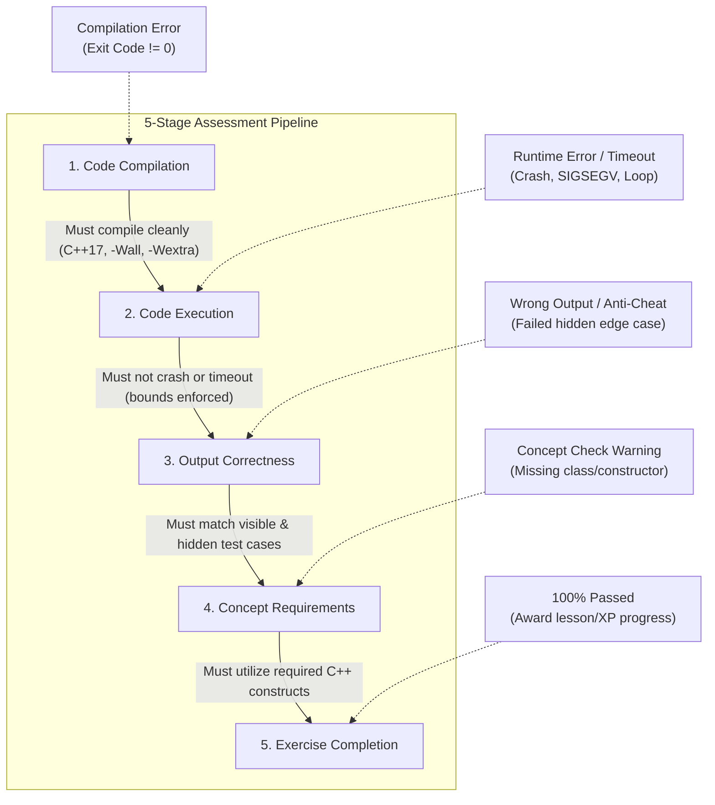
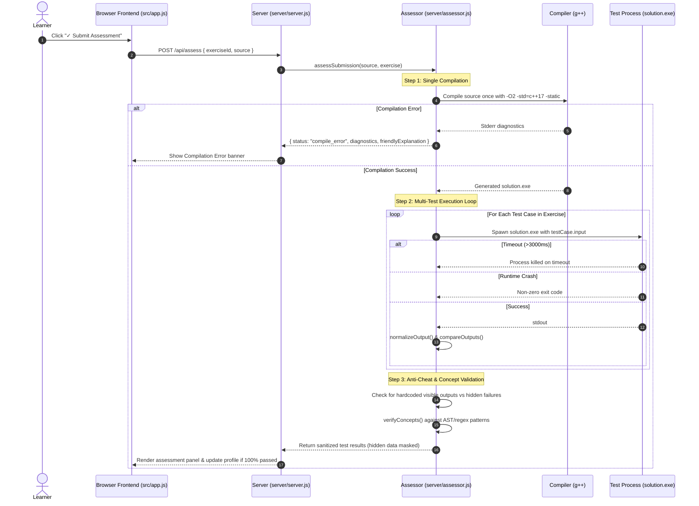

# Phase B Assessment Report: Real Programming Exercise Assessment System

## 1. Executive Summary

Phase B transforms the C++ Trainer from an unconstrained execution environment into a **real programming-exercise assessment platform**.

Learners solve actual coding challenges (e.g. "Calculate average marks", "Implement a class with constructors", "Chain inheritance"). The assessment engine compiles the solution once, runs it against both **visible sample test cases** and **hidden edge-case test cases**, applies robust whitespace-normalized output verification, detects hardcoded output hacks, validates intended language concepts, and renders granular feedback without exposing confidential test data.

---

## 2. Core Architectural Principle: 5-Stage Separation

The assessment system strictly decouples the five evaluation layers:



1. **Compilation != Execution**: A program that compiles is not assumed to work.
2. **Sample Match != Solution Correctness**: Matching visible examples (e.g., hardcoding `cout << 15;`) fails hidden test cases and triggers anti-cheat guidance.
3. **Behavioral Correctness != Concept Demonstration**: A program calculating a square in `main()` without defining `int square(int)` produces correct output but is flagged for missing the required concept.
4. **Completion is Strictly Earned**: Progress is only marked complete in the learner profile when all test cases and concept requirements pass.

---

## 3. Data-Driven Exercise Schema

Exercises are defined in `src/exerciseData.js` and linked to `src/courseData.js`. The model supports complete progression from guided tasks to independent projects:

```typescript
interface Exercise {
  id: string;                          // Unique identifier (e.g., 'keywords-medium')
  title: string;                       // Friendly title ('Sum of Two Numbers')
  concepts: string[];                  // Target concepts (['cin', 'variables', 'arithmetic'])
  difficulty: 'easy' | 'medium' | 'hard';
  level: 1 | 2 | 3 | 4 | 5;            // Guided -> Independent level
  problemStatement: string;            // Plain-English mission description
  constraints?: string[];              // Constraints (e.g., values between -1000 and 1000)
  inputFormat?: string;                // Description of standard input
  outputFormat?: string;               // Description of standard output
  starterCode: string;                 // Scaffolding template
  testCases: Array<{
    id: string;
    description: string;
    input: string;                     // Fed into stdin
    expectedOutput: string;            // Expected stdout
    isHidden?: boolean;                // Confidential test flag
  }>;
  expectedBehavior?: string;
  hints: string[];                     // Progressive hints
  solution: string;                    // Canonical reference solution
  prerequisiteConcepts?: string[];
  conceptChecks?: Array<{              // Structural concept validator
    id: string;
    description: string;
    pattern?: string;                  // Regex pattern to verify construct
    message: string;
  }>;
}
```

### Guided $\longrightarrow$ Independent Progression Levels
- **Level 1 (Fill-in Scaffolding)**: Learner completes missing lines or values (`// TODO:`).
- **Level 2 (Function Implementation)**: Learner writes a specific standalone function (`int square(int n)`).
- **Level 3 (Class / Structure)**: Learner implements a blueprint with members and methods (`class Student`, `Rectangle::area()`).
- **Level 4 (Scaffolded Program)**: Learner implements complete input/output logic with starting structure.
- **Level 5 (Independent Program)**: Learner writes a complete solution from problem statement and constraints alone.

---

## 4. Assessment Engine Workflow (`server/assessor.js`)



---

## 5. Output Normalization & Comparison Strategy

To avoid false negatives caused by minor formatting differences while strictly catching wrong answers:

1. **Line Ending Unification**: Normalizes `\r\n` (Windows) and `\r` (legacy Mac) to `\n`.
2. **Trailing Whitespace Removal**: Trims trailing spaces on individual lines.
3. **Blank Line Truncation**: Strips leading and trailing empty lines from captured standard output.
4. **Token & Numeric Tolerance**:
   - Compares token sequences to allow flexible spacing around delimiters.
   - Allows floating-point decimal tolerances ($< 0.001$) for numeric answers (e.g. `18.3333` vs `18.333333`).
   - Does NOT permit overly permissive substring checks that would allow incorrect answers to pass.

---

## 6. Hidden Tests & Anti-Cheat Protection

Every meaningful exercise includes hidden test cases:
- **Zeroes & Negative Numbers**: Tests identity elements and sign handling (`0 0`, `-15 25`).
- **Boundary Limits**: Extreme constraints and multi-element inputs.
- **Varying Values**: Prevents learners from returning constant outputs.

### Confidentiality Guarantee
Hidden test inputs and expected outputs are **never sent to the client** or exposed upon failure:
```json
{
  "id": "test-3",
  "description": "Test Case 3 (Hidden Test)",
  "isHidden": true,
  "passed": false,
  "status": "wrong_output",
  "message": "Output did not match expected result on hidden test data."
}
```

### Hardcoding Detection
If a submission passes all visible sample tests but fails hidden tests with different inputs, the system returns a targeted warning:
> **⚠️ Generalization Warning**: Your solution passed visible sample tests but failed hidden test cases. Avoid hardcoding outputs—ensure your program dynamically computes results from input.

---

## 7. Educational Concept Verification

Educational exercises often target specific language features. Even if a program's output matches, the system checks whether the learner demonstrated the intended concept:
- **Constructor Check**: Ensures `Rectangle(int, int)` constructor was defined.
- **Inheritance Check**: Verifies `class Student : public Person` syntax.
- **Function Check**: Verifies standalone `int square(int)` was authored.

If the output is correct but the concept is absent, the system flags `status: "concept_warning"`, guiding the learner to implement the required C++ feature without blocking them with obscure errors.

---

## 8. Mode Integration

| Mode | Exercise Source | Feedback Depth | Progression Impact |
|---|---|---|---|
| **Course Mode** | 20 syllabus lessons $\times$ Easy / Medium / Hard exercises | Full diagnostics, sample comparisons, hints available | Advances lesson completion and XP in local profile |
| **Practice Lab** | Curated guided problems (Level 1–3) | Progressive hints, full test breakdowns | Skill reinforcement |
| **Challenge Mode** | Independent complete-program challenges (Level 4–5) | Scaffolding removed, hidden edge cases | Competitive mastery |
| **Mastery Test** | Comprehensive unseen multi-concept problems (Level 5) | Minimal assistance, strict hidden test suites | Final certification |

---

## 9. API Specifications

### `POST /api/assess`
- **Request Body**:
```json
{
  "exerciseId": "keywords-medium",
  "source": "#include <iostream>\nusing namespace std;\nint main() { int a, b; if (cin >> a >> b) cout << a + b; return 0; }"
}
```
- **Response Schema (`200 OK`)**:
```json
{
  "status": "success",
  "passed": true,
  "message": "All 5 test cases passed! Great job!",
  "antiCheatWarning": null,
  "conceptChecks": [],
  "testResults": [
    {
      "id": "test-1",
      "description": "Sample visible test: 5 10",
      "isHidden": false,
      "passed": true,
      "status": "passed",
      "input": "5 10",
      "expectedOutput": "15",
      "actualOutput": "15\n",
      "executionTimeMs": 142
    },
    {
      "id": "test-3",
      "description": "Test Case 3 (Hidden Test)",
      "isHidden": true,
      "passed": true,
      "status": "passed",
      "message": "Output matches expected result.",
      "executionTimeMs": 139
    }
  ],
  "summary": {
    "total": 5,
    "passed": 5,
    "failed": 0
  }
}
```

### `GET /api/exercises`
Returns the exercise catalog metadata with hidden test expected outputs stripped for security.

---

## 10. Verification & Test Results

A full automated test suite was executed via `node --test`:
- **`tests/assessor.test.js`**: 14 tests covering correct solutions, incorrect logic, hardcoded answer anti-cheat detection, edge cases, compilation errors, runtime crashes, timeouts, whitespace handling, hidden test confidentiality, partial success, concept checks, and all modes.
- **`tests/server.test.js`**: 9 tests covering static routing, health checks, execution endpoints, exercise listing, and `/api/assess` integration.
- **`tests/executor.test.js`**: 15 execution engine pipeline tests.
- **`src/learningEngine.test.js`**: Unit tests for adaptive difficulty, navigation, and pre-checks.

**Result: 56/56 automated tests passed (100% pass rate).**

---

## 11. Known Non-Blocking Limitations & Recommendations for Phase C

1. **Continuous Interactive I/O**: Multi-turn conversational input (`cin >> a; cout << prompt; cin >> b;`) is currently evaluated as a single batch stdin stream. Phase C should introduce WebSocket-based terminal streaming for interactive CLI applications.
2. **Static Code Quality Analysis**: Phase C can integrate `clang-tidy` or custom linters for code formatting, memory leak detection (`-fsanitize=address`), and modern C++ best practices.
3. **Client-side WebAssembly Fallback**: Add an optional in-browser Wasm compiler for users running in browser-only environments without local Node/g++ setup.
