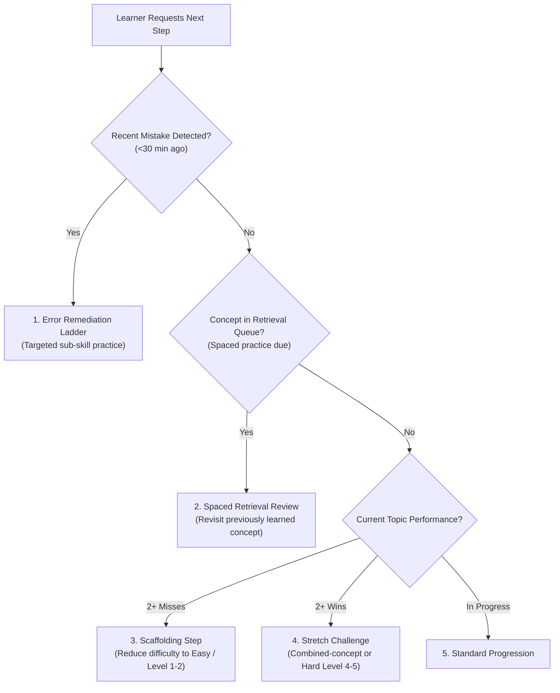

# Phase C Adaptive Learning & Mastery Report: Intelligent Concept Mastery & Progression Engine

## 1. Executive Summary

**Phase C** elevates the CodeBloom C++ Trainer from an exercise evaluation pipeline into an **intelligent, adaptive mastery learning system**.

Rather than treating learning as a binary checklist (`completed = true`), the platform models whether the learner can actually recognize, design, and independently apply C++ concepts without scaffolding or hints. The learner progresses dynamically through:

$$\text{UNDERSTAND} \longrightarrow \text{RECOGNIZE} \longrightarrow \text{MODIFY} \longrightarrow \text{WRITE} \longrightarrow \text{DEBUG} \longrightarrow \text{COMBINE} \longrightarrow \text{SOLVE INDEPENDENTLY}$$

All Phase C systems operate client-side using a versioned schema (`version: 3`) with seamless backward-compatible data migration, a decoupled pub/sub event architecture preparing for animated companion integration (Phase D), and comprehensive automated testing (90/90 tests passing).

---

## 2. Concept Mastery Model

Each C++ concept (e.g. `cin`, `cout`, `variables`, `functions`, `classes`, `constructors`, `inheritance`, `runtime-polymorphism`, `operator-overloading`) is tracked independently with rich behavioral metrics:

```typescript
interface ConceptMastery {
  conceptId: string;
  attempts: number;
  successfulAttempts: number;
  failedAttempts: number;
  compilationErrors: number;
  runtimeErrors: number;
  wrongAnswers: number;
  hintsUsed: number;
  solutionReveals: number;
  difficultyAttempted: { easy: number; medium: number; hard: number };
  difficultySuccessfullyCompleted: { easy: number; medium: number; hard: number };
  recentPerformance: Array<'pass' | 'fail'>; // Sliding window of up to 10 attempts
  independentSuccesses: number;             // Unguided / complete-program solutions
  combinedConceptSuccesses: number;         // Problems requiring multiple concepts
  spacedRetentionSuccesses: number;         // Solved during spaced retrieval reviews
  level: 1 | 2 | 3 | 4 | 5 | 6;
  levelName: 'Introduced' | 'Practicing' | 'Developing' | 'Proficient' | 'Independent' | 'Mastered';
  lastPracticed: number | null;              // Timestamp (epoch ms)
}
```

### The 6 Mastery Levels & Objective Criteria

| Level | Name | Objective Qualification Criteria |
|---|---|---|
| **1** | **Introduced** | Baseline state upon encounter (`attempts >= 0`). Learner has seen the syntax or attempted initial scaffolding. |
| **2** | **Practicing** | `attempts >= 2` with `successfulAttempts >= 1`, or `attempts >= 3`. Active practice on Level 1–2 tasks. |
| **3** | **Developing** | `successfulAttempts >= 2`, at least 1 medium or Level 2+ exercise completed, recent success rate $\ge 45\%$. |
| **4** | **Proficient** | `successfulAttempts >= 4`, at least 2 medium/hard exercises completed, recent success rate $\ge 60\%$, hint ratio $\le 1.5$ per win. |
| **5** | **Independent** | `independentSuccesses >= 2`, at least 1 hard exercise completed, **0 solution reveals**, recent success rate $\ge 70\%$. |
| **6** | **Mastered** | `independentSuccesses >= 3`, `combinedConceptSuccesses >= 2`, `solutionReveals === 0`, at least 1 spaced retention review, recent success rate $\ge 75\%$, `successfulAttempts >= 6`. |

#### Regression Guard
If a learner encounters **3 consecutive failures** on a concept, the engine automatically steps down their level by 1. This prevents false mastery inflation and triggers targeted remediation ladders before the learner is permitted to tackle higher difficulty levels again.

---

## 3. Error Classification & Error-Driven Remediation

Every failed compilation or assessment run is analyzed by `classifyError(assessmentResult, sourceCode, exercise)` into 12 distinct categories:

| Error Category | Diagnostic Trigger | Targeted Pedagogical Action |
|---|---|---|
| `syntax_compilation` | Missing semicolon, unbalanced braces, typo | Line-targeted syntax advice with semicolon and bracket balancing guidance. |
| `constructor_issue` | Constructor signature mismatch, missing initialization | **Remediation Ladder**: 1. Tiny constructor $\rightarrow$ 2. Parameterized constructor $\rightarrow$ 3. Object integration $\rightarrow$ 4. Constructor chaining. |
| `inheritance_issue` | Missing `: public Base`, base method call errors | Hierarchy guidance: base class access specifiers and single inheritance syntax. |
| `polymorphism_issue` | `virtual` missing, pointer dispatch failure | Virtual function contract: base pointers and derived overrides. |
| `operator_overloading_issue`| Operator syntax mismatch, unsupported operands | Operator signature guidance: parameter counts and return types. |
| `input_output_mismatch` | Extra interactive prompt text in output | Stream hygiene: print only requested values without prompts (e.g. "Enter N:"). |
| `edge_case_failure` | Visible tests pass, but hidden edge tests fail | Anti-cheat / edge guidance: test boundary cases (0, negatives, large values). |
| `runtime_error` | Crash, non-zero exit, segmentation fault | Pointer validation, array index bounds, non-zero denominator checks. |
| `timeout` | Infinite loop or waiting on unsupplied input | Loop termination conditions and standard input stream matching. |
| `incorrect_logic` | Calculation error on sample cases | Step-by-step arithmetic tracing with pencil and paper. |

---

## 4. Adaptive Difficulty & Recommendation Engine

The adaptive selector (`getAdaptiveRecommendation`) determines what the learner should code next by evaluating four prioritization layers:



### Recommendation Types Displayed in UI:
- `REMEDIATION`: *"Targeted Practice: Revisit basic constructor declaration before attempting combined class problems."*
- `RETRIEVAL`: *"Spaced Retrieval: It has been a while since you practiced functions. Solidify your memory!"*
- `STRETCH`: *"Level Up: You solved the earlier tasks with high confidence. Stretch your skills with an independent challenge!"*
- `SCAFFOLD`: *"Scaffolding Step: Let’s break the concept down with an easy, guided exercise first."*

---

## 5. Spaced Retrieval Practice Strategy

Concepts are never taught once and permanently left behind. Spaced practice intervals are automatically scheduled upon reaching milestones:

$$\begin{aligned}
\text{Classes} &\implies \text{Queue } \mathbf{Functions} \\
\text{Constructors} &\implies \text{Queue } \mathbf{Classes} \\
\text{Inheritance} &\implies \text{Queue } \mathbf{Constructors} \\
\text{Runtime Polymorphism} &\implies \text{Queue } \mathbf{Inheritance} \\
\text{Operator Overloading} &\implies \text{Queue } \mathbf{Classes}
\end{aligned}$$

When an exercise in a target domain is completed, the engine checks `profile.retrievalQueue` and schedules a review problem featuring the older concept, reinforcing long-term retention.

---

## 6. Combined-Concept & Independent Problem Solving

Real-world programming questions state: **"Write a C++ program to..."** without explicitly naming the language constructs required.

Phase C introduces multi-concept exercises with unlabeled prompts:
- `combined-classes-constructors`: Geometry box computing surface area and volume.
- `combined-classes-arrays`: Shopping cart computing totals from arrays of items.
- `combined-inheritance-virtual`: Payroll system with dynamic runtime polymorphism.

Solving combined-concept problems without hints awards `combinedConceptSuccesses`, which is strictly required to reach **Level 6 (Mastered)**.

---

## 7. Progressive Hint & Solution Reveal System

Every exercise in `src/exerciseData.js` provides exactly **3 progressive hints**:
1. **Hint 1 (Conceptual Nudge)**: Points to the high-level concept or problem breakdown.
2. **Hint 2 (Strategic Approach)**: Recommends the specific data structure or algorithm.
3. **Hint 3 (Syntax Guidance)**: Provides the concrete C++ code pattern or statement.

### Guarded Solution Reveal
- Only available after all 3 hints have been viewed (and completely disabled in Mastery mode).
- Requires explicit user activation.
- Logs `solutionReveals += 1`.
- **Forfeits independent success credit** for that attempt, preventing learners from gaming Level 5 or Level 6 mastery.

---

## 8. Enhanced Mastery Mode

The Mastery mode test suite samples unseen, unguided problems across the syllabus:
- `mastery-student-manager`: Data filtering, min/max search, integer average.
- `mastery-bank-hierarchy`: Multilevel inheritance with deposit/withdraw logic and interest.
- `mastery-complex-calculator`: Complex numbers with operator overloading and stream formatting.

Mastery rules:
- **No hints available** (`🔒 No hints in mastery`).
- **No solution reveals**.
- Evaluated against hidden test suites.

---

## 9. Learning Event Bus Contract

To decouple learning mechanics from future animations and gamification (Phase D), `src/eventBus.js` provides a centralized pub/sub dispatcher:

```typescript
export const LEARNING_EVENTS = {
  CODE_STARTED: 'CODE_STARTED',
  COMPILE_FAILED: 'COMPILE_FAILED',
  RUNTIME_FAILED: 'RUNTIME_FAILED',
  TEST_FAILED: 'TEST_FAILED',
  TEST_PASSED: 'TEST_PASSED',
  EXERCISE_COMPLETED: 'EXERCISE_COMPLETED',
  HINT_USED: 'HINT_USED',
  SOLUTION_REVEALED: 'SOLUTION_REVEALED',
  CONCEPT_IMPROVED: 'CONCEPT_IMPROVED',
  CONCEPT_MASTERED: 'CONCEPT_MASTERED',
  DIFFICULTY_INCREASED: 'DIFFICULTY_INCREASED',
  DIFFICULTY_DECREASED: 'DIFFICULTY_DECREASED'
};
```

### Usage Pattern for Phase D
```javascript
import { eventBus, LEARNING_EVENTS } from './eventBus.js';

// Phase D Companion can subscribe anywhere:
eventBus.on(LEARNING_EVENTS.CONCEPT_MASTERED, ({ conceptId }) => {
  companion.playAnimation('cheer', `Mastered ${conceptId}!`);
});

eventBus.on(LEARNING_EVENTS.HINT_USED, ({ hintIndex, totalHints }) => {
  companion.playAnimation('thinking', `Hint ${hintIndex}/${totalHints}`);
});
```

---

## 10. Files Created and Modified

| File | Status | Description |
|---|---|---|
| `src/eventBus.js` | **NEW** | Decoupled pub/sub event bus with 12 standard learning lifecycle events. |
| `src/masteryEngine.js` | **NEW** | 6-level mastery model, regression guard, 12 error classifiers, adaptive recommendation engine, spaced retrieval scheduler, and profile schema migration. |
| `tests/mastery.test.js` | **NEW** | 25 automated tests covering all 9 Phase C requirement areas. |
| `docs/PHASE_C_ADAPTIVE_LEARNING_REPORT.md` | **NEW** | Comprehensive handoff documentation and technical specification. |
| `src/exerciseData.js` | **MODIFIED** | Enriched all exercises with 3 progressive hints; added combined-concept problems and syllabus-spanning mastery problems. |
| `src/courseData.js` | **MODIFIED** | Attached new mastery exercises to `masteryExercises`. |
| `src/learningEngine.js` | **MODIFIED** | Re-exported mastery engine and event bus; enhanced `formatAssessmentFeedback` with error classification; updated `updateLearnerProfile`. |
| `src/app.js` | **MODIFIED** | Automatic profile migration (v3); recommendation banner; progressive hint accordion; solution reveal modal; concept mastery pills; event bus wiring. |
| `src/style.css` | **MODIFIED** | Added styling for recommendation banners, concept level pills, progressive hint accordion, solution boxes, and error diagnosis cards. |
| `package.json` | **MODIFIED** | Updated `build` script to check `masteryEngine.js` and `eventBus.js`. |

---

## 11. Test Results & Verification

- **Automated Test Suites**: **90/90 tests passing** across 18 test suites (`npm test`):
  - `Concept Mastery Model & 6-Level Progression`: 7/7 passed
  - `Error Classification Engine`: 7/7 passed
  - `Adaptive Difficulty & Recommendation Engine`: 5/5 passed
  - `Spaced Retrieval Scheduling`: 2/2 passed
  - `Progressive Hints & Solution Reveal Penalties`: 3/3 passed
  - `Combined-Concept & Mastery Assessments`: 3/3 passed
  - `Profile Migration & Persistence`: 2/2 passed
  - `Learning Event Bus Decoupled Contract`: 2/2 passed
  - `Comprehensive Edge Cases`: 3/3 passed
  - `Assessor Unit Tests`: 4/4 passed
  - `Assessment Engine Live Compiler Tests`: 14/14 passed
  - `Compiler Detection & Diagnostics`: 5/5 passed
  - `Execution Layer Input Validation`: 2/2 passed
  - `C++ Execution Pipeline (Live Compiler)`: 15/15 passed
  - `HTTP Server & Endpoints`: 9/9 passed
  - `Course Data Tests`: 7/7 passed
- **Production Build Check**: `npm run build` exits **0** (clean AST validation on all 8 backend and frontend modules).

---

## 12. Known Limitations & Recommended Phase D Work

1. **Client-Side Persistence Only**:
   - Learner progress lives in `localStorage`. Cross-device sync or classroom leaderboards would require an optional cloud sync layer.
2. **Phase D Preparation**:
   - The event bus contract is fully in place. Phase D can directly connect the animated companion, XP reward engine, and achievement unlock system by subscribing to `eventBus` events without touching core learning algorithms.
