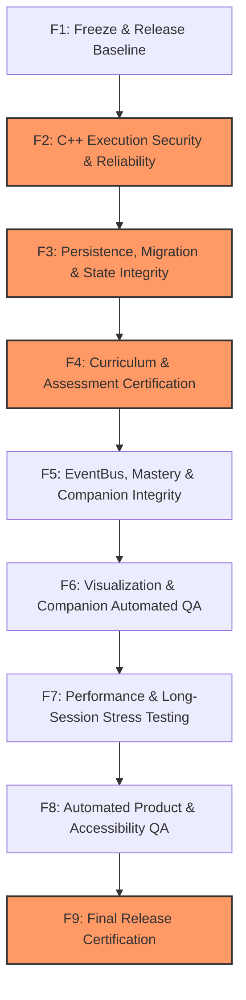
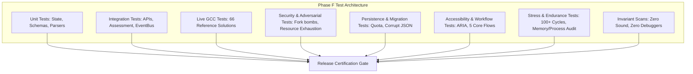

# Phase F — Production Hardening & Release Plan

> **CodeBloom C++ Interactive Trainer**  
> **Repository:** `https://github.com/rohitpandit007/cpp-trainer`  
> **Target Document:** `docs/PHASE_F_PRODUCTION_HARDENING_PLAN.md`  
> **Status:** Implementation-Ready Architectural Plan  
> **Preceding Completed Phases:** A through E7 (Baseline: 421 tests passing, 27 build checks clean, 75 curriculum exercises, 8 held-out transfer benchmarks, 66 live GCC reference solutions)

---

## 1. Executive Summary

### 1.1 Why Phase F Exists
CodeBloom has successfully progressed through Phases A through E7, evolving from an initial syllabus scaffold into a feature-rich, interactive C++ training platform. Over these phases, the system gained real C++ compilation, multi-case behavioral assessment, 6-tier adaptive mastery, an EventBus decoupled architecture, an animated Pikachu companion, static concept visualization, gamification with achievements and streaks, Level 5 concept-hidden independent challenges, and an 8-problem held-out transfer benchmark battery.

However, feature expansion has concluded. CodeBloom now faces the transition from active pedagogical development to **production-hardening, execution reliability, host security, and release certification**. 

Phase F exists to eliminate operational fragility:
1. **Arbitrary Code Execution Safety:** Learner C++ source code is compiled and executed on the host system. The execution pipeline must be hardened against fork bombs, resource exhaustion, filesystem tampering, infinite loops, and environment leakage.
2. **State & Persistence Resiliency:** Learner profiles, mastery levels, and gamification state must survive malformed JSON, corrupted `localStorage`, out-of-quota errors, and schema migrations with zero data loss.
3. **Curriculum & Assessment Certification:** All 75 curriculum exercises and 8 benchmark problems must be certified with 100% passing live reference solutions, zero concept leakage, and robust anti-hardcoding defenses.
4. **Architectural Invariant Enforcement:** The system must strictly guarantee the absolute prohibitions against sound and runtime debuggers, while ensuring the EventBus never leaks memory or produces duplicate XP/mastery awards.
5. **Session Stability & Stress Endurance:** CodeBloom must run indefinitely without memory growth, DOM node accumulation, timer leaks, or orphaned compiler/executable child processes.

### 1.2 What Phase F Does
- Hardens the Node.js server execution pipeline (`server/executor.js`, `server/assessor.js`, `server/server.js`) against adversarial learner code.
- Hardens client-side persistence, error boundaries, and profile schema migration (`src/masteryEngine.js`, `src/app.js`, `src/gamification/gamificationEngine.js`).
- Automates verification across curriculum, reference solutions, and benchmark isolation (`scripts/validateCurriculum.js`, `scripts/runBenchmark.js`, `tests/`).
- Conducts long-session automated stress testing (100+ execution cycles, 100+ state transitions) to measure memory, process, and DOM stability.
- Performs headless automated accessibility (a11y) and responsive layout audits across standard viewports (375px, 768px, 1024px, 1440px+).
- Establishes a definitive, automated release certification gate.

### 1.3 What Phase F Explicitly Does NOT Do
- **NO Curriculum Expansion:** Catalog remains frozen at 75 curriculum exercises and 8 benchmark transfer problems. Zero new exercises will be added.
- **NO New Architecture:** No secondary EventBus, no parallel state store, no new gamification engine, and no new mastery algorithms.
- **NO Sound:** Strictly zero Web Audio API, `Audio()`, `<audio>`, speech synthesis, or audio configuration.
- **NO Runtime Tracing:** Strictly zero `gdb`, `lldb`, CPU registers, or process memory debuggers.
- **NO Unnecessary UI Redesign:** UI layout, styling, and branding remain stable; changes are limited to accessibility tags, error bounds, and bug fixes.
- **NO Out-of-Scope C++ Topics:** No templates, STL containers, exceptions, lambdas, threads, or smart pointers unless already present in current tests.

### 1.4 Relationship to Phases E7 and E8
- **Phase E7 (Completed):** Established the 8-problem transfer benchmark battery, analytical scoring model, and automated archetype simulation.
- **Phase F (This Plan):** Delivers the battle-tested, secure, and leak-free production platform required to host real learners.
- **Phase E8 (Future Cohort Validation):** Empirical trials with human learner cohorts require a platform that will not crash, corrupt learner progress, or expose host server vulnerabilities during prolonged use. Phase F provides this prerequisite operational substrate.

---

## 2. Current System Baseline

An exhaustive inspection of the current working directory (`d:\website project\sample cpp`) establishes the empirical baseline:

| Dimension | Actual Repository Baseline | Key Source / Test Reference |
| :--- | :--- | :--- |
| **Passing Test Count** | **421 passing tests** (0 failing, 0 skipped) | `node --test --test-concurrency=1` across 14 test files |
| **Test Suite Count** | **20 suites** (top-level describe blocks) | Reported by Node.js built-in test runner |
| **Build Syntax Check** | **27 / 27 files valid** (clean syntax) | `npm run build` (`node --check` on all modules/scripts) |
| **Syllabus Modules** | **5 modules** covering original syllabus | [`src/courseData.js`](file:///d:/website%20project/sample%20cpp/src/courseData.js) (`modules`) |
| **Syllabus Lessons** | **20 lessons** | [`src/courseData.js`](file:///d:/website%20project/sample%20cpp/src/courseData.js) (`rows`, `lessons`) |
| **Curriculum Exercise Slots**| **60 slot exercises** (mini, medium, hard) | [`src/courseData.js`](file:///d:/website%20project/sample%20cpp/src/courseData.js) (`lessonObj.exercises`) |
| **Total Catalog Exercises**  | **75 exercises** (60 slot + 15 combined/mastery) | [`src/exerciseData.js`](file:///d:/website%20project/sample%20cpp/src/exerciseData.js) (`exerciseCatalog`) |
| **Level 5 Independent Items**| **18 exercises** (concept-hidden prompts) | Audited in Phase E6 / [`tests/benchmark.test.js`](file:///d:/website%20project/sample%20cpp/tests/benchmark.test.js) |
| **Benchmark Transfer Battery**| **8 held-out transfer problems** | [`src/benchmark/benchmarkData.js`](file:///d:/website%20project/sample%20cpp/src/benchmark/benchmarkData.js) (`benchmarkBattery`) |
| **Live GCC Solutions**       | **66 verified solutions** (58 curriculum + 8 bench)| [`tests/exerciseSolutions.test.js`](file:///d:/website%20project/sample%20cpp/tests/exerciseSolutions.test.js), [`tests/benchmarkSolutions.test.js`](file:///d:/website%20project/sample%20cpp/tests/benchmarkSolutions.test.js) |
| **Curriculum Validator**     | **0 errors, 0 warnings** | [`scripts/validateCurriculum.js`](file:///d:/website%20project/sample%20cpp/scripts/validateCurriculum.js) |
| **Benchmark CLI Runner**     | **Score 4.91 / 5.00 (Grade A)** | [`scripts/runBenchmark.js`](file:///d:/website%20project/sample%20cpp/scripts/runBenchmark.js) |
| **Companion Asset Inventory**| **12 state illustrations** (`assets/pikachu/`) | [`src/companion/assetRegistry.js`](file:///d:/website%20project/sample%20cpp/src/companion/assetRegistry.js) |
| **Profile Schema Version**   | **Version 3** (with v1/v2 auto-migration) | [`src/masteryEngine.js`](file:///d:/website%20project/sample%20cpp/src/masteryEngine.js) (`migrateProfile`) |
| **EventBus Architecture**    | **18 learning events**, pub/sub pattern | [`src/eventBus.js`](file:///d:/website%20project/sample%20cpp/src/eventBus.js) (`LEARNING_EVENTS`) |
| **Runtime Dependencies**     | **0 external npm dependencies** | [`package.json`](file:///d:/website%20project/sample%20cpp/package.json) (pure Node.js built-in modules) |
| **Audio / Sound Elements**   | **0** (strictly prohibited) | Audited in [`tests/workspacePolish.test.js`](file:///d:/website%20project/sample%20cpp/tests/workspacePolish.test.js) |
| **Debugger / Tracing Hooks** | **0** (strictly prohibited) | Static & AST analysis only in [`src/visualization/`](file:///d:/website%20project/sample%20cpp/src/visualization/) |

---

## 3. Phase F Goals

1. **Deterministic Execution Security:** Ensure host server resilience against adversarial C++ programs (infinite loops, fork bombs, memory exhaustion, filesystem traversal, environment variable extraction).
2. **Crash-Proof State Management:** Ensure learner progress, mastery, gamification, and benchmark results are resilient to `localStorage` quota limits, corrupted JSON, missing keys, and schema evolutions with zero data loss.
3. **Curriculum Certification:** Formally certify that 100% of curriculum exercises and benchmark transfer problems compile and pass under live GCC, with zero concept leakage and verified anti-hardcoding defenses.
4. **Architectural Integrity:** Verify single-transaction idempotency across EventBus subscribers, preventing duplicate XP, unearned achievements, or cross-mode state contamination between benchmark and training.
5. **Lifecycle and Memory Safety:** Guarantee zero memory growth, zero detached DOM nodes, zero timer leaks, and zero zombie compiler/binary processes during prolonged learner sessions.
6. **Accessible Product Quality:** Ensure WCAG 2.1 AA keyboard navigability, screen reader semantics (`aria-live`, `role="status"`, focus traps), and responsive layout stability across mobile (375px), tablet (768px), laptop (1024px), and desktop (1440px+).
7. **Automated Release Certification:** Construct a single, reproducible CLI validation gate that executes the entire validation matrix and enforces zero tolerance for P0/P1 defects.

---

## 4. Phase F Non-Goals

1. **NO Curriculum Expansion:** The catalog of 75 exercises and 8 benchmark problems is frozen.
2. **NO New Architecture:** No Redux, no MobX, no secondary EventBus, and no parallel state managers.
3. **NO Sound or Audio:** No `<audio>`, Web Audio API, or text-to-speech.
4. **NO Runtime Tracing:** No `gdb`, `lldb`, CPU instruction tracing, or register inspection.
5. **NO Unnecessary UI Overhaul:** Layout and visual styling remain stable; focus is on accessibility, error containment, and responsiveness.
6. **NO Advanced C++ Scope Creep:** No templates, STL algorithms, smart pointers, threads, or networking added to the core curriculum.
7. **NO Fabricated Human Data:** Simulated archetype models remain explicitly labeled as synthetic validation artifacts.

---

## 5. Subphase Dependency Graph



### Parallelization & Ordering Constraints
- **F1 (Freeze)** must run first to record immutable baselines.
- **F2 (Execution Security)** is a **P0 Hard Blocker**. If the backend execution engine can be crashed or exploited, client-side hardening is compromised.
- **F3 (Persistence)** can proceed once F2 verifies safe execution payloads.
- **F4 (Curriculum)** depends on stable executor and assessor behavior from F2.
- **F5 (EventBus)** and **F6 (UI/Visualizer)** can be developed in close coordination once state models (F3) are locked.
- **F7 (Stress Testing)** requires F2–F6 to be complete so the full stack can be exercised under continuous load.
- **F8 (Product & A11y QA)** builds on the stable UI components validated in F6 and F7.
- **F9 (Release Certification)** is the final sequential capstone that evaluates all previous subphases against release gates.

---

## 6. Detailed Plan for Subphases F1 through F9

---

### F1 — Freeze & Release Baseline

#### Objective
Establish an immutable, auditable baseline of CodeBloom's codebase, inventories, schemas, test suites, and build metrics before any hardening modifications begin.

#### Why It Matters
Production hardening requires an objective before/after regression boundary. Without recording exact file counts, test assertion totals, schema snapshots, and asset inventories, subsequent fixes risk silent regressions or scope creep.

#### Current Repository Areas to Inspect
- `package.json` (scripts, dependencies, node flags)
- `server/server.js`, `server/executor.js`, `server/assessor.js`
- `src/courseData.js`, `src/exerciseData.js`, `src/benchmark/benchmarkData.js`
- `src/masteryEngine.js` (Schema Version 3 definition)
- `src/companion/assetRegistry.js` (12 illustration assets)
- `tests/` (14 test files containing 421 tests across 20 suites)

#### Files Likely to Be Modified
- `docs/PHASE_F1_RELEASE_BASELINE_REPORT.md` (NEW)
- `scripts/generateReleaseManifest.js` (NEW)
- `package.json` (Add script `"baseline": "node scripts/generateReleaseManifest.js"`)

#### New Files / Tests / Scripts to Create
- `scripts/generateReleaseManifest.js`: Inspects the repo and dumps an automated release manifest JSON containing file hashes, test totals, exercise counts, and schema signatures.
- `tests/baselineIntegrity.test.js`: Verifies that file inventories and key constants match the freeze manifest.

#### Automated Test Strategy
Run `npm test` and `npm run build` headlessly. Execute `node scripts/generateReleaseManifest.js` to assert that 75 curriculum exercises, 8 benchmarks, 12 companion assets, and 421 tests are accounted for.

#### Adversarial Cases
- Corrupted or phantom exercise entries in `exerciseCatalog`.
- Missing assets referenced in `assetRegistry.js`.
- Discrepancies between `src/courseData.js` rows (20 lessons) and `exerciseCatalog` IDs.

#### Implementation Strategy
1. Author `scripts/generateReleaseManifest.js` utilizing pure Node.js built-ins (`crypto`, `fs`, `path`).
2. Calculate SHA-256 hashes of critical data files (`src/courseData.js`, `src/exerciseData.js`, `src/benchmark/benchmarkData.js`).
3. Record exact Node.js environment details (v22+, Windows platform, architecture).
4. Author `docs/PHASE_F1_RELEASE_BASELINE_REPORT.md` with complete inventories.

#### Regression Risks
Zero. F1 is strictly introspective and does not alter application behavior.

#### Preservation Requirements
Preserve exact current counts: 75 exercises, 8 benchmarks, 12 companion images, 20 syllabus lessons, 421 tests.

#### Deliverables
- `docs/PHASE_F1_RELEASE_BASELINE_REPORT.md`
- `scripts/generateReleaseManifest.js`
- `release-manifest.json`

#### Exit Criteria
- Manifest generated automatically via CLI.
- 100% agreement between manifest, git status, and test suite counts.
- 0 warnings, 0 missing files.

#### Release Gates
- `npm run build` exits 0.
- All 421 baseline tests exit 0.

---

### F2 — C++ Execution Security & Reliability

#### Objective
Conduct a comprehensive adversarial audit and implement production-grade hardening of the C++ compilation and execution pipeline (`server/executor.js`, `server/assessor.js`, `server/server.js`) against arbitrary learner code execution risks.

#### Why It Matters
This is a **P0 Critical Subphase**. CodeBloom allows users to compile and run arbitrary C++ source code. A malicious or accidental student error (fork bomb, infinite recursive thread spawn, `/dev/urandom` read, writing to parent directories, reading sensitive environment variables, running `system("rm -rf /")`) could crash the host process or compromise the operating system.

#### Current Repository Areas to Inspect
- [`server/executor.js`](file:///d:/website%20project/sample%20cpp/server/executor.js): Inspect `runCompilation`, `runExecutable`, `killProcessTree`, temporary directory creation (`crypto.randomBytes`), timeout mechanisms (`DEFAULT_TIMEOUT_MS = 3000`), and output limits (`DEFAULT_MAX_OUTPUT_BYTES = 64KB`).
- [`server/assessor.js`](file:///d:/website%20project/sample%20cpp/server/assessor.js): Inspect multi-case loop, test case timeouts, and temporary folder lifecycle (`cpp-assess-${runId}`).
- [`server/server.js`](file:///d:/website%20project/sample%20cpp/server/server.js): Inspect payload parsing limits (`MAX_BODY_BYTES = 512KB`), static file traversal checks (`safePath.startsWith(ROOT_DIR)`), and error boundaries.

#### Files Likely to Be Modified
- `server/executor.js`:
  - Enhance compiler flags: add `-fno-asm`, `-fstack-protector-strong`, resource-limiting compiler options.
  - Sanitize environment variables: strip sensitive host environment variables (`AWS_*`, `TOKEN`, `KEY`, `SECRET`, `HOMEPATH`, `USERPROFILE`) before spawning child processes; pass only sanitized `PATH` and minimal system vars.
  - Hardened process termination: verify `taskkill /PID ${pid} /T /F` on Windows and process group kill `-pid` on POSIX reliably terminate runaway subprocesses.
  - Temporary folder isolation: ensure temporary directory is deleted inside a deterministic `finally` block with retry backoff.
- `server/server.js`:
  - Enforce strict JSON payload limits and reject non-string/malformed parameters before dispatch.
  - Rate limiting / concurrent execution limit: introduce a lightweight queue or concurrency cap (e.g., max 4 concurrent compilations) to prevent server thread-pool exhaustion.

#### New Files / Tests / Scripts to Create
- `tests/executionSecurity.test.js` (NEW): Adversarial test suite containing:
  - Infinite loops (`while(true){}`) -> must terminate cleanly in <= 3500ms with `status: "timeout"`.
  - Memory exhaustion (`int* p = new int[1000000000];` or vector expansion) -> must exit with `status: "runtime_error"` without crashing host Node.js.
  - Deep recursion / stack exhaustion (`void f(){f();} int main(){f();}`) -> must exit with stack overflow runtime error cleanly.
  - Excessive stdout/stderr flooding (`while(1) cout << "spam";`) -> output buffer truncated at 64KB with `truncated: true`, process terminated.
  - Command injection via system call (`system("dir")` or `system("whoami")`) -> process execution must not leak host shell output to learner interface.
  - Environment variable extraction (`getenv("PATH")`, `getenv("LOCALAPPDATA")`) -> verify sanitized environment.
  - Path traversal in temporary workspace (`ofstream out("../../escape.txt")`) -> execution working directory isolated; verify no writes escape `os.tmpdir()`.
  - Rapid concurrent requests (10 simultaneous compile/run calls) -> all resolve without zombie processes or file collisions.

#### Automated Test Strategy
Automated execution of `tests/executionSecurity.test.js` against live GCC on the host. Every adversarial attack must return a structured JSON response (`timeout`, `runtime_error`, or `compile_error`) and never cause an unhandled rejection, unhandled exception, or process lockup.

#### Adversarial Cases
1. **Fork Bomb / Process Spam:** `#include <windows.h> ... CreateProcess(...)` or `fork()`.
2. **Compiler Crash Exploits:** `#include </dev/null>` or deep recursive macros (`#define A B #define B A`).
3. **Compiler Timeout:** Extremely complex template instantiation or macro recursion exceeding 8000ms.
4. **Binary Lock on Windows:** Executable held open by anti-virus or background process preventing folder cleanup.
5. **Zero-Byte Source Code:** Empty string or pure whitespace submission.
6. **Huge Binary Size / Static Buffer:** Allocating giant static BSS segments (`char buf[500000000];`).

#### Implementation Strategy
1. Audit existing `killProcessTree` in `server/executor.js`. Verify process group PID semantics.
2. In `server/executor.js`, construct a sanitized `cleanEnv` object:
   ```javascript
   const SAFE_ENV_KEYS = ['PATH', 'SYSTEMROOT', 'TEMP', 'TMP', 'COMSPEC', 'PATHEXT'];
   const sanitizedEnv = {};
   for (const key of SAFE_ENV_KEYS) {
     if (process.env[key]) sanitizedEnv[key] = process.env[key];
   }
   ```
3. Add `-fdiagnostics-color=never` and `-pipe` to compilation flags.
4. Enforce concurrency gate using an async semaphore in `server/server.js` or `server/executor.js`.
5. Run adversarial test battery.

#### Regression Risks
Overly restrictive compiler flags could reject valid standard C++ constructs (e.g., `-std=c++17`). Hardening must preserve full standard C++17 support for all 75 curriculum exercises and 8 benchmark problems.

#### Preservation Requirements
Preserve existing assessment API format: `{ status, passed, message, testResults, summary, compilation }`.

#### Deliverables
- `server/executor.js` (hardened)
- `server/server.js` (concurrency guard & sanitized environment)
- `tests/executionSecurity.test.js` (adversarial suite)
- `docs/PHASE_F2_EXECUTION_SECURITY_REPORT.md`

#### Exit Criteria
- 100% of adversarial execution security tests pass.
- Zero orphan processes remain in OS process tree (`tasklist` clean).
- Zero residual files in `os.tmpdir()` after execution completes.
- Host Node.js server survives 50 consecutive adversarial executions without crash.

#### Release Gates
- **P0 Gate:** Zero critical or high-severity execution security vulnerabilities.
- **P0 Gate:** Host server never crashes on adversarial inputs.

---

### F3 — Persistence, Migration & State Integrity

#### Objective
Harden client-side state storage, profile validation, gamification persistence, and schema migration against corrupted data, version drift, and `localStorage` storage failures.

#### Why It Matters
Learner trust is destroyed if progress, streak data, or mastery achievements vanish due to a browser crash, malformed JSON, or private browsing quota restrictions. Currently, `src/app.js` performs `JSON.parse(localStorage.getItem('codebloom-profile'))` directly at startup. A single corrupted byte will crash the entire application during boot.

#### Current Repository Areas to Inspect
- [`src/app.js`](file:///d:/website%20project/sample%20cpp/src/app.js#L22-L26): Inspect `rawStored`, `migratedStored`, `save()`, and theme persistence.
- [`src/masteryEngine.js`](file:///d:/website%20project/sample%20cpp/src/masteryEngine.js#L598-L648): Inspect `migrateProfile`, `createConceptMastery`, and mastery records.
- [`src/gamification/gamificationEngine.js`](file:///d:/website%20project/sample%20cpp/src/gamification/gamificationEngine.js): Inspect XP, level, achievement state, streak timestamps, and daily reset logic.
- [`src/companion/pikachuCompanion.js`](file:///d:/website%20project/sample%20cpp/src/companion/pikachuCompanion.js#L228-L232): Inspect minimized toggle persistence (`codebloom-companion-minimized`).

#### Files Likely to Be Modified
- `src/storageManager.js` (NEW): Centralized, fault-tolerant persistence abstraction encapsulating `localStorage`, memory fallback, and corruption recovery.
- `src/masteryEngine.js`:
  - Enhance `migrateProfile` to validate all nested fields (ensuring `conceptMastery[k].attempts` is numeric, `recentPerformance` is an array, etc.).
  - Add schema validator function: `validateProfileSchema(profile)`.
- `src/app.js`:
  - Replace raw `localStorage.getItem` with `storageManager.getProfile()`.
  - Wrap `save()` in try/catch handling `QuotaExceededError` gracefully.
  - Ensure benchmark mode actions NEVER pollute `profile.completed`, `profile.topics`, or gamification streaks.

#### New Files / Tests / Scripts to Create
- `src/storageManager.js`:
  - Features: Safe parse, memory cache fallback when `localStorage` is disabled (e.g. Incognito/iframe), quota detection, state serialization, schema validation, and corruption recovery.
- `tests/persistenceIntegrity.test.js` (NEW):
  - Empty storage boot -> initializes clean v3 profile.
  - Corrupted JSON (`{ invalid: json `) -> auto-recovers to default profile without throwing.
  - Partial / missing properties (missing `conceptMastery`, null `gamification`) -> repaired with defaults.
  - Migration from v1, v2 to v3 -> verified data retention of completed topics and wins.
  - Idempotent migration -> migrating an already-v3 profile produces an identical snapshot.
  - Unknown future version (`version: 99`) -> safe fallback or non-destructive read.
  - `QuotaExceededError` simulation -> fails gracefully, flags user notification, does not crash.
  - Benchmark isolation check -> running and passing a benchmark problem does not increment normal exercise completion count or curriculum progress.

#### Automated Test Strategy
Execute `tests/persistenceIntegrity.test.js` via Node.js test runner using mocked storage environments. Verify that 100% of invalid, malformed, and truncated state payloads cleanly resolve to valid v3 profile structures.

#### Adversarial Cases
1. **Truncated JSON in storage:** Simulating browser crash midway through `localStorage.setItem`.
2. **Type Poisoning:** `attempts: "many"`, `level: null`, `recentPerformance: "pass"`.
3. **Negative Numbers:** `xp: -500`, `streak: -3`.
4. **Infinite/NaN Values:** `lastPracticed: NaN`.
5. **Cross-Mode Leakage:** Completing benchmark problem `bench-sensor-telemetry` must not mark lesson `classes` as completed.

#### Implementation Strategy
1. Build `src/storageManager.js` following the canonical pipeline:
   $$\text{Load} \longrightarrow \text{Validate} \longrightarrow \text{Migrate} \longrightarrow \text{Repair/Default} \longrightarrow \text{Commit}$$
2. Add defensive defaults for every field in `createConceptMastery`.
3. Separate benchmark telemetry into its own key (`codebloom-benchmark-results`) if persistence is desired, strictly isolated from `codebloom-profile`.

#### Regression Risks
Existing user profiles saved in localStorage must not be wiped or reset. Migration must retain all existing completed lessons and XP.

#### Preservation Requirements
Preserve profile schema v3 compatibility and gamification engine bindings.

#### Deliverables
- `src/storageManager.js`
- `tests/persistenceIntegrity.test.js`
- `docs/PHASE_F3_STATE_INTEGRITY_REPORT.md`

#### Exit Criteria
- 100% pass on persistence integrity test suite.
- Zero unhandled exceptions when booting with corrupt, empty, or legacy storage.
- Verified isolation between benchmark state and curriculum progression.

#### Release Gates
- **P0 Gate:** Storage corruption can never prevent application boot.
- **P1 Gate:** 100% data retention across simulated profile migrations.

---

### F4 — Curriculum & Assessment Certification

#### Objective
Certify that all 75 curriculum exercises, 20 syllabus lessons, 60 difficulty slots, and 8 held-out benchmark problems satisfy every schema requirement, compile cleanly under live GCC, and feature bulletproof anti-hardcoding defenses.

#### Why It Matters
CodeBloom's core value is authentic C++ learning. If any reference solution fails to compile, if test assertions fail due to minor whitespace differences, or if learners can game assessments by printing hardcoded values for visible test cases, the pedagogical integrity of the system fails.

#### Current Repository Areas to Inspect
- [`src/courseData.js`](file:///d:/website%20project/sample%20cpp/src/courseData.js): 20 lessons, 5 modules, `masteryExercises`.
- [`src/exerciseData.js`](file:///d:/website%20project/sample%20cpp/src/exerciseData.js): 75 catalog exercises, starter code, test cases, hints.
- [`src/benchmark/benchmarkData.js`](file:///d:/website%20project/sample%20cpp/src/benchmark/benchmarkData.js): 8 benchmark transfer problems and reference solutions.
- [`scripts/validateCurriculum.js`](file:///d:/website%20project/sample%20cpp/scripts/validateCurriculum.js): Validation rules, concept checks, schema checks.
- [`tests/exerciseSolutions.test.js`](file:///d:/website%20project/sample%20cpp/tests/exerciseSolutions.test.js) & [`tests/benchmarkSolutions.test.js`](file:///d:/website%20project/sample%20cpp/tests/benchmarkSolutions.test.js): Live GCC reference solution verification.

#### Files Likely to Be Modified
- `scripts/validateCurriculum.js`:
  - Add automated concept leakage detector: scans Level 5 independent and benchmark prompts for mechanism keywords (`class`, `virtual`, `operator`, `override`, `protected`, `friend`).
  - Add anti-hardcoding validator: checks that every exercise has at least one hidden test case with non-trivial input.
  - Add starter code check: verifies that independent Level 5 exercises have unguided, blank-canvas starter code.
- `tests/curriculumValidator.test.js`: Update to assert 0 errors, 0 warnings across all 75 curriculum exercises and 8 benchmarks.

#### New Files / Tests / Scripts to Create
- `tests/curriculumCertification.test.js` (NEW):
  - Comprehensive live GCC assessment of all 66 reference solutions (58 curriculum + 8 benchmark).
  - Adversarial hardcoding test: runs a mock solution that hardcodes visible test outputs and verifies that `assessor.js` flags `antiCheatWarning` and fails hidden test cases.
  - Zero concept leakage audit: programmatically scans all 18 Level 5 prompts and 8 benchmark prompts.
  - Syllabus slot integrity: verifies that each of the 20 lessons maps valid `mini`, `medium`, and `hard` exercises without fallbacks.

#### Automated Test Strategy
Run `node scripts/validateCurriculum.js` and `node --test tests/curriculumCertification.test.js`. Every reference solution is compiled with host `g++` and evaluated across 100% of visible and hidden test cases.

#### Adversarial Cases
1. **Lookup Table / Echo Cheat:** Solution contains `if (input == "A") cout << "X"; else cout << "Y";` -> Must fail hidden test cases.
2. **Whitespace Variations:** Output contains trailing spaces or CRLF -> `normalizeOutput` in `assessor.js` must handle whitespace fairly without false failures.
3. **Floating-Point Roundoff:** Expected output is `3.14`, learner produces `3.1400` -> `compareOutputs` must evaluate with numeric tolerance.
4. **Crash on Hidden Input:** Learner code segfaults on negative or zero inputs -> Correctly reported as hidden test runtime error without leaking hidden input data.

#### Implementation Strategy
1. Integrate the concept-leakage regex scanner directly into `scripts/validateCurriculum.js`.
2. Ensure every exercise in `exerciseCatalog` has explicit `constraints`, `inputFormat`, and `outputFormat`.
3. Verify that hidden test outputs are stripped in `server/server.js` (`/api/exercises` endpoint) so learners cannot inspect browser network responses to find hidden test answers.

#### Regression Risks
Modifying test case comparison rules could accidentally break borderline reference solutions. All changes must be verified against all 66 live solutions.

#### Preservation Requirements
Preserve the frozen 75 curriculum exercises and 8 benchmark transfer problems. Zero catalog drift.

#### Deliverables
- `scripts/validateCurriculum.js` (enhanced with leakage and anti-hardcoding audits)
- `tests/curriculumCertification.test.js`
- `docs/PHASE_F4_CURRICULUM_ASSESSMENT_CERTIFICATION_REPORT.md`

#### Exit Criteria
- 0 curriculum validation errors, 0 warnings.
- 66 / 66 reference solutions compile and achieve 100% pass under live GCC.
- 0 concept leaks detected across Level 5 and benchmark prompts.
- Adversarial hardcoded solutions fail 100% of hidden test suites.

#### Release Gates
- **P0 Gate:** 100% reference solution pass rate.
- **P0 Gate:** 0 concept leakage across independent problems.

---

### F5 — EventBus, Mastery, Gamification & Companion Integrity

#### Objective
Audit and harden the decoupled event-driven architecture (`src/eventBus.js`, `src/masteryEngine.js`, `src/gamification/gamificationEngine.js`, `src/companion/companionController.js`) against race conditions, duplicate event processing, listener accumulation, and cross-subsystem state corruption.

#### Why It Matters
One user action (e.g. clicking "Submit & Assess") triggers an asynchronous cascade: compilation, test execution, assessment generation, EventBus emissions (`TEST_PASSED`, `EXERCISE_COMPLETED`), XP accumulation, streak increment, achievement checks, companion state transition, and mastery recalculation. If events fire twice or lack transaction idempotency, learners can gain duplicate XP, unlock erroneous achievements, or cause the companion to stutter.

#### Current Repository Areas to Inspect
- [`src/eventBus.js`](file:///d:/website%20project/sample%20cpp/src/eventBus.js): Pub/sub implementation, wildcard support, `clear()`, `on`, `off`.
- [`src/gamification/gamificationEngine.js`](file:///d:/website%20project/sample%20cpp/src/gamification/gamificationEngine.js): Event bindings for `EXERCISE_COMPLETED`, `TEST_PASSED`, `INDEPENDENT_SUCCESS`.
- [`src/companion/companionController.js`](file:///d:/website%20project/sample%20cpp/src/companion/companionController.js): Subscriptions, priority arbitration, temporary timer management.
- [`src/masteryEngine.js`](file:///d:/website%20project/sample%20cpp/src/masteryEngine.js): Down-leveling regression guards, sliding window.

#### Files Likely to Be Modified
- `src/eventBus.js`:
  - Add optional event deduplication / idempotency window: prevent identical event payloads from firing within same tick if desired.
  - Add debug subscription tracker: track active listener count per event type to prevent listener leaks across re-renders.
- `src/gamification/gamificationEngine.js`:
  - Add transaction ID guard: ensure an `EXERCISE_COMPLETED` event with the same `(exerciseId, submissionTimestamp)` cannot award XP twice.
  - Isolate benchmark events: ensure benchmark exercise completions do not trigger normal XP or streak awards.
- `src/companion/companionController.js`:
  - Ensure all `activeTimer` and `typingTimer` handles are safely cleared on re-bind or state preemption.

#### New Files / Tests / Scripts to Create
- `tests/eventArchitectureIntegrity.test.js` (NEW):
  - Rapid event sequence test: fire 50 rapid `CODE_STARTED` and `TEST_PASSED` events; verify no uncaught errors or listener explosion.
  - Idempotency test: duplicate `EXERCISE_COMPLETED` events with identical transaction IDs award XP exactly once.
  - Listener cleanup test: call `bindEventBus()` and `unbindEventBus()` 20 times; verify listener count returns to baseline (0 memory leak).
  - Priority preemption test: `ULTIMATE_MASTERY` (priority 100) cannot be overridden by `TEST_PASSED` (priority 40).
  - Absolute Invariant Scan: programmatic AST / regex scan across entire repository confirming ZERO occurrences of `AudioContext`, `<audio>`, `webkitAudioContext`, `speechSynthesis`, `gdb`, `lldb`, or debugger attachments.

#### Automated Test Strategy
Execute `tests/eventArchitectureIntegrity.test.js` via Node.js test runner. Validate state snapshots and listener counts before and after event storms.

#### Adversarial Cases
1. **Double Click / Rapid Submit:** User clicks submit button 5 times in 100ms.
2. **Out-of-Order Execution:** Assessment result arrives after user has switched to another exercise.
3. **Circular Event Cascades:** A listener in Gamification emitting an event that triggers another listener back in Mastery.

#### Implementation Strategy
1. Attach unique `transactionId` (`crypto.randomUUID` or timestamp-hash) to assessment execution payloads.
2. Add transaction cache (`Set<string>`) to `GamificationEngine` holding recent transaction IDs (max 50).
3. Implement `eventBus.listenerCount(eventName)` for diagnostic verification.

#### Regression Risks
Altering event dispatch order could disrupt companion speech bubbles or header pill updates. Thoroughly verify against `tests/companionInteraction.test.js` and `tests/gamification.test.js`.

#### Preservation Requirements
Maintain existing 18 `LEARNING_EVENTS` enum constants and method signatures.

#### Deliverables
- `src/eventBus.js` (hardened)
- `src/gamification/gamificationEngine.js` (idempotent transactions)
- `tests/eventArchitectureIntegrity.test.js`
- `docs/PHASE_F5_EVENT_ARCHITECTURE_REPORT.md`

#### Exit Criteria
- Zero duplicate XP or achievement awards under simulated event replay.
- Zero listener accumulation after 100 bind/unbind cycles.
- 100% clean scan on invariant prohibitions (zero audio, zero debuggers).

#### Release Gates
- **P0 Gate:** Absolute Invariant Scan passes with 0 violations.
- **P1 Gate:** 100% event idempotency verified.

---

### F6 — Visualization & Companion Automated QA

#### Objective
Conduct automated quality assurance and lifecycle hardening of the Concept Visualizer (`src/visualization/`) and Pikachu Companion (`src/companion/`) components, verifying asset fallbacks, keyboard accessibility, and static analysis boundaries.

#### Why It Matters
The visualizer and companion provide CodeBloom's distinctive interactive engagement. If an image asset fails to load, if a C++ syntax error breaks the static AST analyzer, or if the companion avatar obstructs mobile interactive buttons, the user experience degrades. Furthermore, the visualizer must strictly remain a conceptual static analysis tool and never falsely represent actual CPU registers or hardware ABI.

#### Current Repository Areas to Inspect
- [`src/companion/assetRegistry.js`](file:///d:/website%20project/sample%20cpp/src/companion/assetRegistry.js): 12 asset paths, active character selection, fallback URL.
- [`src/companion/pikachuCompanion.js`](file:///d:/website%20project/sample%20cpp/src/companion/pikachuCompanion.js): DOM mounting, double-buffered image swap, speech bubble cycling, minimized state, focus handling.
- [`src/visualization/conceptAnalyzer.js`](file:///d:/website%20project/sample%20cpp/src/visualization/conceptAnalyzer.js): Regex/AST parser for classes, inheritance, heap allocations (`new`/`delete`).
- [`src/visualization/timelineModel.js`](file:///d:/website%20project/sample%20cpp/src/visualization/timelineModel.js): Step generation, stack frames, heap objects.
- [`src/visualization/conceptVisualizer.js`](file:///d:/website%20project/sample%20cpp/src/visualization/conceptVisualizer.js): Drawer open/close, navigation, keyboard controls.

#### Files Likely to Be Modified
- `src/visualization/conceptAnalyzer.js`:
  - Enhance parsing robustness on malformed or incomplete C++ code (e.g., unmatched braces, missing semicolons, template noise). Must return clean empty analysis instead of throwing.
- `src/companion/pikachuCompanion.js`:
  - Ensure all 12 assets have verified `onerror` fallbacks to `idle.png`.
  - Verify keyboard focus outlines and ARIA attributes (`aria-expanded`, `aria-hidden`).
- `src/companion/companion.css` & `src/visualization/visualizer.css`:
  - Verify responsive docking rules and z-index layering so Pikachu never covers primary action buttons (Run, Submit, Hints).

#### New Files / Tests / Scripts to Create
- `tests/companionVisualizationQA.test.js` (NEW):
  - Missing asset test: simulates 404 on companion image; asserts fallback URL is rendered without image broken icon.
  - Malformed C++ source stress test: passes 30 pathological C++ snippets (unclosed classes, random characters, empty source) into `conceptAnalyzer`; verifies zero exceptions thrown.
  - Visualizer timeline navigation test: verify bounds clamping on step navigation (`prevStep` at 0 stays at 0; `nextStep` at end stays at end).
  - Reduced motion audit: verify that `prefers-reduced-motion` suppresses all CSS transforms and transitions across companion and visualizer stylesheets.
  - Static model invariant audit: verify that `conceptAnalyzer.js` contains zero references to `gdb`, registers, or hardware ABI.

#### Automated Test Strategy
Run `tests/companionVisualizationQA.test.js` under Node.js test runner with JSDOM / mocked DOM elements. Audit CSS files using static regex / AST rules for media query coverage.

#### Adversarial Cases
1. **Broken Image URLs:** Simulated CDN failure for companion assets.
2. **Pathological C++ Input:** 10,000 lines of unclosed braces fed into `ConceptAnalyzer`.
3. **Rapid Drawer Toggling:** Opening and closing the visualizer drawer 50 times in rapid succession.
4. **Extreme Zoom / Small Viewport:** Companion dock behavior at 320px viewport width.

#### Implementation Strategy
1. Wrap `conceptAnalyzer.analyze()` in a top-level defensive error boundary returning a fallback empty model if parsing fails.
2. Verify that all 12 illustration files in `assets/pikachu/` exist on disk and match the registry names.
3. Test double-buffered image swapping logic when images fail to load.

#### Regression Risks
Changes to `conceptAnalyzer` must not break existing timeline steps for standard lessons. Verify against `tests/visualization.test.js`.

#### Preservation Requirements
Visualizer must strictly remain a conceptual, educational static model. Never add runtime CPU tracing.

#### Deliverables
- `src/visualization/conceptAnalyzer.js` (defensive error containment)
- `tests/companionVisualizationQA.test.js`
- `docs/PHASE_F6_COMPANION_VISUALIZATION_REPORT.md`

#### Exit Criteria
- 100% of companion assets verified on disk.
- Zero exceptions in `conceptAnalyzer` on malformed source code.
- Zero visual occlusion of workspace buttons by companion dock.

#### Release Gates
- **P1 Gate:** 100% graceful handling of malformed C++ code in static visualizer.
- **P1 Gate:** Asset fallback verified for all companion states.

---

### F7 — Performance & Long-Session Stress Testing

#### Objective
Design, execute, and document automated stress tests simulating continuous long-duration learner sessions (100+ compilation/run cycles, 100+ exercise switches, 100+ companion transitions) to verify memory stability, process cleanup, and zero resource leakage.

#### Why It Matters
A user or classroom cohort may keep CodeBloom open in a browser tab for hours, running dozens of programs. If child processes are orphaned on the server, if temporary folders accumulate in `os.tmpdir()`, if DOM elements leak in the client, or if timers are never cleared, the application will steadily slow down and eventually crash.

#### Current Repository Areas to Inspect
- `server/executor.js` and `server/assessor.js`: Temporary folder creation and deletion.
- `server/server.js`: Process and connection handling.
- `src/app.js`: DOM rendering lifecycle (`render()`, `addLessonNavigation()`).
- `src/companion/companionController.js`: Active timer handles (`activeTimer`, `typingTimer`).
- `src/visualization/conceptVisualizer.js`: Animation frames and player timers.

#### Files Likely to Be Modified
- `server/executor.js`:
  - Strengthen cleanup routine: add startup garbage collection for orphaned `cpp-trainer-*` and `cpp-assess-*` directories left behind by abnormal server terminations.
- `scripts/stressTest.js` (NEW): Automated headless stress test script.

#### New Files / Tests / Scripts to Create
- `scripts/stressTest.js`:
  - Simulates 100 continuous compile/run requests to `/api/execute`.
  - Simulates 100 continuous assessment requests to `/api/assess`.
  - Simulates 50 rapid exercise transitions.
  - Monitors host memory usage (`process.memoryUsage()`) before, during, and after the test.
  - Inspects `os.tmpdir()` to assert that exactly 0 orphaned folders remain.
  - Asserts that OS process count does not grow.
- `tests/stressEndurance.test.js` (NEW): Automated integration test running a 30-cycle micro-stress sequence within standard test suite execution.

#### Automated Test Strategy
Execute `node scripts/stressTest.js` and record heap memory growth and process counts. Assert that heap growth settles within a reasonable plateau (< 30MB growth) and returns to baseline following garbage collection.

#### Adversarial Cases
1. **Server restart during active compilation:** Verifying startup cleanup cleans stale temporary files.
2. **Client disconnect midway through compilation:** Verifying server child process is terminated when HTTP request is aborted (`req.on('close')`).
3. **Rapid Staccato Submissions:** 100 submissions sent with 10ms intervals.

#### Implementation Strategy
1. In `server/server.js`, attach an abort listener to `req`:
   ```javascript
   req.on('close', () => {
     if (!finished && currentChildPid) {
       killProcessTree(currentChildPid);
     }
   });
   ```
2. In `server/executor.js`, add `cleanStaleTempDirectories()` invoked once during server startup: deletes any folder matching `cpp-trainer-*` or `cpp-assess-*` older than 10 minutes.
3. Profile memory usage with `process.memoryUsage().heapUsed`.

#### Regression Risks
Aggressive cleanup must never delete temporary directories of actively running peer compilations. Use timestamp checks (> 10 minutes old) for startup cleanup.

#### Preservation Requirements
Ensure execution times and latency do not degrade under normal usage.

#### Deliverables
- `scripts/stressTest.js`
- `tests/stressEndurance.test.js`
- `docs/PHASE_F7_PERFORMANCE_STRESS_REPORT.md`

#### Exit Criteria
- 100 consecutive compile/run cycles executed with 0 failures and 0 zombie processes.
- Net temporary directory leak = 0.
- Net memory growth remains bounded (< 30MB over 100 iterations).

#### Release Gates
- **P0 Gate:** Zero orphaned compiler or binary processes after stress test.
- **P1 Gate:** Zero temporary directory accumulation.

---

### F8 — Automated Product & Accessibility QA

#### Objective
Maximize automated headless product quality and accessibility (a11y) verification across key learner workflows and responsive viewports, compensating for the deliberate exclusion of manual QA.

#### Why It Matters
Manual QA is explicitly omitted from this engineering project. Therefore, product correctness and accessibility compliance must be established through rigorous automated DOM testing, ARIA audits, keyboard navigation verification, and responsive viewport checks.

#### Current Repository Areas to Inspect
- `index.html`: Shell structure, viewport meta tag, landmark roles, title.
- `src/app.js`: Interactive navigation, modal dialogs, achievement toasts, editor container, execution output panels.
- `src/style.css`, `src/companion/companion.css`, `src/visualization/visualizer.css`: Media queries, `:focus-visible` styling, responsive grid/flex layouts.
- `tests/workspacePolish.test.js`: Existing accessibility and sound prohibition checks.

#### Files Likely to Be Modified
- `src/app.js`:
  - Enhance ARIA attributes: add `aria-busy="true"` on editor/run buttons during compilation.
  - Trap focus within achievement modals and visualizer drawer when open; restore focus on close.
  - Add descriptive `aria-label`s to all icon-only buttons (theme toggle, companion toggle, visualizer controls).
- `src/style.css`:
  - Verify high-contrast `:focus-visible` outline (`2px solid var(--accent)`) across all interactive elements.

#### New Files / Tests / Scripts to Create
- `tests/productWorkflows.test.js` (NEW): Automated simulation of the 5 core learner workflows:
  1. **Workflow 1 (Guided Progression):** Lesson -> Exercise -> Compile -> Error -> Fix -> Pass -> Next Difficulty.
  2. **Workflow 2 (Scaffolded Hint Flow):** Lesson -> Exercise -> Request Hint 1 -> Request Hint 2 -> Solve -> Pass.
  3. **Workflow 3 (Independent Problem Solving):** Select Practice/Challenge -> Level 5 Blank Canvas -> Code -> Compile -> Pass with Zero Hints -> Verify Independent Success attribution.
  4. **Workflow 4 (Benchmark Evaluation):** Benchmark Mode -> Select Unseen Problem -> Verify Hints Disabled -> Submit -> Verify Evaluation Engine scoring.
  5. **Workflow 5 (Mastery Transition):** Complete topic prerequisites -> Trigger Level 6 Mastery -> Verify Companion Celebration and Gamification Level Up.
- `tests/accessibilityAudit.test.js` (NEW):
  - Validates ARIA landmark hierarchy (`<header>`, `<main>`, `<aside>`, `role="complementary"`).
  - Validates `aria-live="polite"` on output console and speech bubble.
  - Validates that interactive buttons have non-empty accessible names.
  - Validates keyboard focus traps and Esc key dismissal on modals and drawers.
  - Validates responsive CSS rules for standard breakpoints (375px, 768px, 1024px, 1440px).

#### Automated Test Strategy
Execute `tests/productWorkflows.test.js` and `tests/accessibilityAudit.test.js` via Node.js test runner using JSDOM. Verify that all 5 workflows complete their end-to-end state transitions without errors.

#### Adversarial Cases
1. **Rapid Keyboard Spam:** Pressing Tab, Enter, and Esc in rapid sequences during modal animations.
2. **Screen Reader Live Region Flooding:** Ensuring `aria-live` regions do not announce intermediate typing debounce events.
3. **Viewport Shrink to 320px:** Ensuring no horizontal overflow or unreachable buttons on extreme small screens.

#### Implementation Strategy
1. Formalize workflow test helpers that programmatically instantiate state, trigger simulated DOM events, and assert state and DOM changes.
2. Validate against WCAG 2.1 AA automated rule subsets.

#### Regression Risks
Changes to focus management must not cause focus stealing while the user is actively typing in the code editor.

#### Preservation Requirements
Preserve existing visual styling and color hierarchy.

#### Deliverables
- `tests/productWorkflows.test.js`
- `tests/accessibilityAudit.test.js`
- `docs/PHASE_F8_AUTOMATED_PRODUCT_QA_REPORT.md`

#### Exit Criteria
- 5 / 5 core learner workflows pass end-to-end in automated tests.
- 0 accessibility violations in automated ARIA/keyboard audit.
- Responsive layout rules verified across 375px, 768px, 1024px, and 1440px+.

#### Release Gates
- **P1 Gate:** All 5 core workflows pass end-to-end.
- **P1 Gate:** 100% accessible names on interactive controls.

---

### F9 — Final Release Certification

#### Objective
Execute the comprehensive, automated release validation pipeline across all subphases, evaluate every release gate, and produce the definitive release certification report for CodeBloom.

#### Why It Matters
This is the final capstone of the entire CodeBloom development lifecycle. It aggregates every validation tool into a single unified CLI gate. No release occurs unless every automated check passes with zero errors and zero warnings.

#### Current Repository Areas to Inspect
- Entire repository, all test suites, scripts, build steps, manifests, and documentation.

#### Files Likely to Be Modified
- `scripts/verifyRelease.js` (NEW): Unified release validation script that runs all checks and outputs a formal pass/fail scorecard.
- `package.json`: Add `"verify:release": "node scripts/verifyRelease.js"`.
- `docs/PHASE_F9_RELEASE_CERTIFICATION_REPORT.md` (NEW).

#### New Files / Tests / Scripts to Create
- `scripts/verifyRelease.js`:
  - Step 1: Syntax & Build Validation (`npm run build`).
  - Step 2: Full Test Suite Execution (`npm test`).
  - Step 3: Curriculum Validation (`node scripts/validateCurriculum.js`).
  - Step 4: Benchmark Battery Execution (`node scripts/runBenchmark.js`).
  - Step 5: Stress & Cleanup Verification (`node scripts/stressTest.js`).
  - Step 6: Invariant Scans (Zero Sound, Zero Debugger Tracing).
  - Step 7: Release Scorecard Compilation.
- `tests/releaseCertification.test.js` (NEW): Test verifying that `verifyRelease.js` executes and exits with code 0.

#### Automated Test Strategy
Execute `npm run verify:release`. Verify that all sub-tasks complete, outputting a structured markdown scorecard with exit code 0.

#### Adversarial Cases
- Intentionally injected syntax errors or broken tests must cause `verifyRelease.js` to fail immediately with a non-zero exit code.
- Simulated sound or debugger tokens must fail the invariant check.

#### Implementation Strategy
1. Build `scripts/verifyRelease.js` as an orchestrator using `node:child_process` `spawnSync`.
2. Format output cleanly for both terminal display and automated markdown generation.
3. Author `docs/PHASE_F9_RELEASE_CERTIFICATION_REPORT.md`.

#### Regression Risks
Zero. F9 is the validation and reporting capstone.

#### Preservation Requirements
Zero modifications to application logic in F9.

#### Deliverables
- `scripts/verifyRelease.js`
- `tests/releaseCertification.test.js`
- `docs/PHASE_F9_RELEASE_CERTIFICATION_REPORT.md`

#### Exit Criteria
- `npm run verify:release` completes cleanly with exit code 0.
- All 15 release gates verified as PASS.
- Hard failure criteria = 0.

#### Release Gates
- **FINAL GATE:** 100% of all release gates PASS.

---

## 7. Severity Classification

Every finding discovered during Phase F execution must be classified according to this rubric:

| Level | Classification | Definition | SLA / Resolution Rule | Release Blocker? |
| :---: | :--- | :--- | :--- | :---: |
| **P0** | **Critical Security / Crash** | Arbitrary host command execution, server crash, persistent storage crash preventing boot, data loss of existing learner profiles, or violation of absolute invariants (Sound / Debugger present). | **Must be fixed immediately.** No release can proceed with any open P0. | **YES (Hard Blocker)** |
| **P1** | **Important Production Defect** | Reference solution fails compilation, assessment gives false failure on valid C++, duplicate XP/achievement exploit, memory leak during prolonged session, broken core workflow. | **Must be resolved before F9.** Cannot be deferred to post-release. | **YES (Release Blocker)** |
| **P2** | **Normal Hardening** | Suboptimal error message phrasing, minor responsive padding misalignment at specific viewport, non-critical keyboard focus order improvement. | **Fix during assigned subphase.** Document if deferred with user consent. | **NO (If documented)** |
| **P3** | **Optional Polish / Cleanup** | Code comment formatting, minor refactoring of internal helper function, non-user-facing cleanup. | **Fix only if zero risk to stability.** Otherwise document in final report. | **NO** |

---

## 8. Automated Testing Strategy

Phase F significantly expands automated test coverage while preserving all existing test suites:



### Coverage Expansion Breakdown
1. **Unit Tests:** Deep schema validation, parser error boundaries, and score calculation.
2. **Integration Tests:** Server endpoints (`/api/execute`, `/api/assess`), EventBus subscriptions, and companion state transitions.
3. **Live GCC Verification:** Direct compilation of all 66 reference solutions (58 curriculum + 8 benchmark) using the host C++ compiler.
4. **Adversarial Security Tests:** Hardening against malicious or runaway learner code without relying on external sandbox daemons.
5. **Headless Browser / DOM Tests:** JSDOM-driven automated validation of modals, double-buffered image swapping, responsive layout rules, and accessibility attributes.
6. **Stress Endurance:** Continuous execution loops measuring process table stability, temporary folder deletion, and memory boundaries.

---

## 9. Security Threat Model: Arbitrary C++ Execution

Because CodeBloom compiles and executes untrusted, learner-provided C++ code, the security architecture must defend against primary attack vectors:

| Threat Vector | Potential Impact | Hardening Mechanism in Phase F |
| :--- | :--- | :--- |
| **Process Fork Bomb** | Host CPU / thread exhaustion crashing Node.js | Strict compilation `-fno-asm`; aggressive process-tree termination via `taskkill /PID /T /F` (Windows) or `process.kill(-pid, 'SIGKILL')` (POSIX) triggered by 3000ms timer. |
| **Memory Bomb (`new` / `malloc`)** | Host out-of-memory crash | Enforce process heap boundaries; detect non-zero exit codes on allocation failure (`std::bad_alloc`); terminate child process safely. |
| **Infinite Loop / Runaway IO** | Hanging thread, giant log files | 3000ms hard runtime timeout; 64KB max output buffer clamp (`truncated: true`); immediate process kill. |
| **Filesystem Traversal** | Overwriting system files, reading secrets | Random isolated temporary execution directories (`cpp-trainer-${runId}`); static file server blocks directory traversal (`safePath.startsWith(ROOT_DIR)`); temporary folder deletion in `finally` blocks. |
| **Environment Variable Leak** | Exposing API keys, cloud tokens, or paths | Process spawning passes a heavily sanitized environment (`cleanEnv`) containing only essential OS runtime paths, stripping all credentials. |
| **Command Injection via Shell** | Spawning unauthorized system utilities | Node.js `spawn` uses direct binary invocation with argument arrays, never passing unsanitized strings to `/bin/sh` or `cmd.exe`. |
| **Compiler Crash Exploits** | Compiler hang via recursive macros | 8000ms hard compilation timeout; process tree termination on timeout. |

---

## 10. State Integrity Model

The state lifecycle across profile, mastery, gamification, and benchmark domains is governed by a strict unidirectional pipeline:

```
[ LocalStorage / Browser State ]
              │
              ▼
   1. Safe Load (Try / Catch)
              │
              ▼
   2. Schema Validation (Validate Keys & Types)
              │
              ▼
   3. Auto-Migration (v1 / v2 ──► v3)
              │
              ▼
   4. Repair / Defaulting (Fallback missing fields)
              │
              ▼
   5. Active Application State
              │
              ├──► Learning Engine & Mastery
              ├──► Gamification Engine (Idempotent XP)
              └──► Benchmark Mode (Isolated from Progress)
              │
              ▼
   6. Safe Atomic Save (Quota-Exceeded Catch)
```

### Benchmark State Isolation Rules
1. Benchmark problem submissions are evaluated by `server/assessor.js` but do NOT emit `EXERCISE_COMPLETED` for curriculum topics.
2. Benchmark completions do NOT increment `profile.completed` or normal topic win streaks.
3. Hints and solutions are strictly suppressed during benchmark mode (`state.mode === 'benchmark'`).
4. Benchmark transfer scores and gap analyses are maintained in isolated telemetry objects.

---

## 11. Release Gates (Final Certification Checklist)

CodeBloom will only be certified as **Release-Ready** when every item on this checklist is verified:

```
====================================================================================================
                        CODEBLOOM PRODUCTION RELEASE GATE CHECKLIST
====================================================================================================
[ ] GATE 01: BUILD SYNTAX CHECK           -> npm run build exits 0 (27/27 files clean)
[ ] GATE 02: BASELINE REGRESSION          -> All 421 baseline tests pass with 0 failures
[ ] GATE 03: EXECUTION SECURITY           -> 100% of adversarial execution tests pass
[ ] GATE 04: HOST RESILIENCE              -> Host Node.js never crashes under adversarial load
[ ] GATE 05: PERSISTENCE INTEGRITY        -> Safe boot verified on corrupt, empty, and legacy storage
[ ] GATE 06: MIGRATION PRESERVATION       -> 100% retention of learner history during v1/v2 -> v3 migration
[ ] GATE 07: CURRICULUM CONFORMANCE       -> 0 curriculum errors, 0 curriculum warnings
[ ] GATE 08: REFERENCE SOLUTIONS          -> 66 / 66 reference solutions pass 100% under live GCC
[ ] GATE 09: ANTI-HARDCODING RIGOR        -> Adversarial hardcoded solutions fail hidden test suites
[ ] GATE 10: CONCEPT LEAKAGE PREVENTION   -> 0 mechanism keywords in Level 5 and benchmark prompts
[ ] GATE 11: EVENTBUS IDEMPOTENCY         -> 0 duplicate XP, achievements, or streaks on replayed events
[ ] GATE 12: COMPANION & ASSET INTEGRITY  -> All 12 assets verified on disk; fallbacks functional
[ ] GATE 13: STRESS ENDURANCE             -> 100 cycles completed with 0 zombie processes & 0 folder leaks
[ ] GATE 14: ACCESSIBILITY & A11Y         -> 0 violations in automated ARIA, focus, and keyboard audit
[ ] GATE 15: ABSOLUTE INVARIANTS          -> STRICTLY ZERO sound APIs; STRICTLY ZERO runtime debuggers
====================================================================================================
OVERALL VERDICT: [ PASS / FAIL ]
====================================================================================================
```

---

## 12. Reports Produced

During Phase F execution, the following 9 subphase reports must be generated in `docs/`:

1. `docs/PHASE_F1_RELEASE_BASELINE_REPORT.md`
2. `docs/PHASE_F2_EXECUTION_SECURITY_REPORT.md`
3. `docs/PHASE_F3_STATE_INTEGRITY_REPORT.md`
4. `docs/PHASE_F4_CURRICULUM_ASSESSMENT_CERTIFICATION_REPORT.md`
5. `docs/PHASE_F5_EVENT_ARCHITECTURE_REPORT.md`
6. `docs/PHASE_F6_COMPANION_VISUALIZATION_REPORT.md`
7. `docs/PHASE_F7_PERFORMANCE_STRESS_REPORT.md`
8. `docs/PHASE_F8_AUTOMATED_PRODUCT_QA_REPORT.md`
9. `docs/PHASE_F9_RELEASE_CERTIFICATION_REPORT.md`

---

## 13. Expected Test & Validation Matrix

| Subphase | Test Suite / Target Area | Type | Automated? | Priority | Primary Evidence File | Release Blocker? |
| :---: | :--- | :--- | :---: | :---: | :--- | :---: |
| **F1** | Baseline Inventories & Hashes | Unit / Hash | YES | P1 | `docs/PHASE_F1_RELEASE_BASELINE_REPORT.md` | YES |
| **F2** | Execution Security & Adversarial Code | Adversarial / Integration | YES | P0 | `tests/executionSecurity.test.js` | **YES (P0)** |
| **F2** | Environment Variable & Path Isolation | Security Audit | YES | P0 | `docs/PHASE_F2_EXECUTION_SECURITY_REPORT.md` | **YES (P0)** |
| **F3** | Corrupt Storage & Quota Recovery | Unit / Integration | YES | P0 | `tests/persistenceIntegrity.test.js` | **YES (P0)** |
| **F3** | Profile Migration v1/v2 -> v3 | Migration Unit | YES | P1 | `docs/PHASE_F3_STATE_INTEGRITY_REPORT.md` | YES |
| **F3** | Benchmark State Isolation | Integration | YES | P1 | `tests/persistenceIntegrity.test.js` | YES |
| **F4** | Curriculum Schema & Taxonomy Audit | Validator CLI | YES | P0 | `scripts/validateCurriculum.js` | **YES (P0)** |
| **F4** | Live GCC Reference Solutions (66) | Live Compilation | YES | P0 | `tests/curriculumCertification.test.js` | **YES (P0)** |
| **F4** | Anti-Cheat & Anti-Hardcoding Rigor | Adversarial Assessment | YES | P1 | `tests/curriculumCertification.test.js` | YES |
| **F4** | Zero Concept Leakage Audit | Static AST / Regex | YES | P0 | `docs/PHASE_F4_CURRICULUM_ASSESSMENT_CERTIFICATION_REPORT.md` | **YES (P0)** |
| **F5** | EventBus Deduplication & Idempotency | Unit / Integration | YES | P1 | `tests/eventArchitectureIntegrity.test.js` | YES |
| **F5** | Absolute Invariant Scan (No Sound/GDB)| Static Scan | YES | P0 | `tests/eventArchitectureIntegrity.test.js` | **YES (P0)** |
| **F6** | Companion Asset Loading & Fallbacks | DOM / Integration | YES | P1 | `tests/companionVisualizationQA.test.js` | YES |
| **F6** | Concept Analyzer Malformed Source | Parser Stress | YES | P1 | `tests/companionVisualizationQA.test.js` | YES |
| **F7** | 100-Cycle Endurance & Memory Stability | Long-Session Stress | YES | P0 | `scripts/stressTest.js` | **YES (P0)** |
| **F7** | Process & Temp Directory Cleanup | OS Resource Audit | YES | P0 | `docs/PHASE_F7_PERFORMANCE_STRESS_REPORT.md` | **YES (P0)** |
| **F8** | 5 Core Learner Workflows End-to-End | E2E Integration | YES | P1 | `tests/productWorkflows.test.js` | YES |
| **F8** | Accessibility, ARIA & Responsive QA | A11y DOM Audit | YES | P1 | `tests/accessibilityAudit.test.js` | YES |
| **F9** | Final Release Certification Suite | Multi-Suite Gate | YES | P0 | `docs/PHASE_F9_RELEASE_CERTIFICATION_REPORT.md` | **YES (P0)** |

---

## 14. Recommended Execution Order

Future Antigravity coding sessions should execute Phase F strictly in the following sequential order:

```
Session 1: Execute F1 (Freeze Baseline & Manifest)
              ↓
Session 2: Execute F2 (Execution Security & Adversarial Hardening) [P0 Blocker]
              ↓
Session 3: Execute F3 (Persistence, Migration & Storage Resiliency)
              ↓
Session 4: Execute F4 (Curriculum, Live GCC Solutions & Anti-Cheat Certification)
              ↓
Session 5: Execute F5 (EventBus, Idempotency & Invariant Scans)
              ↓
Session 6: Execute F6 (Visualizer & Companion Automated QA)
              ↓
Session 7: Execute F7 (Performance, 100-Cycle Stress & Leak Audit)
              ↓
Session 8: Execute F8 (Automated Workflows & Accessibility QA)
              ↓
Session 9: Execute F9 (Final Release Certification Gate)
```

---

## 15. Antigravity Session Boundaries

To prevent scope creep, accidental regression, or cross-subphase contamination, future sessions must adhere to these strict modification boundaries:

| Session / Subphase | Allowed Modifications | Prohibited Modifications |
| :--- | :--- | :--- |
| **Session 1 (F1)** | `scripts/generateReleaseManifest.js`, `docs/PHASE_F1_*`, `package.json` (scripts only) | NO modifications to `src/` or `server/`. |
| **Session 2 (F2)** | `server/executor.js`, `server/server.js`, `tests/executionSecurity.test.js`, `docs/PHASE_F2_*` | NO modifications to curriculum, UI, or companion. |
| **Session 3 (F3)** | `src/storageManager.js`, `src/masteryEngine.js` (migration), `src/app.js` (storage calls), `tests/persistenceIntegrity.test.js`, `docs/PHASE_F3_*` | NO modifications to `server/` execution logic. |
| **Session 4 (F4)** | `scripts/validateCurriculum.js`, `tests/curriculumCertification.test.js`, `docs/PHASE_F4_*` | NO changes to exercise IDs, titles, or curriculum scope. |
| **Session 5 (F5)** | `src/eventBus.js`, `src/gamification/gamificationEngine.js` (dedup), `tests/eventArchitectureIntegrity.test.js`, `docs/PHASE_F5_*` | NO alterations to event names or mastery formula tiers. |
| **Session 6 (F6)** | `src/visualization/conceptAnalyzer.js` (error containment), `src/companion/pikachuCompanion.js` (a11y/fallbacks), `tests/companionVisualizationQA.test.js`, `docs/PHASE_F6_*` | NO addition of audio tags or runtime debuggers. |
| **Session 7 (F7)** | `scripts/stressTest.js`, `server/executor.js` (stale folder GC), `tests/stressEndurance.test.js`, `docs/PHASE_F7_*` | NO feature additions. |
| **Session 8 (F8)** | `tests/productWorkflows.test.js`, `tests/accessibilityAudit.test.js`, `src/app.js` (ARIA tags), `docs/PHASE_F8_*` | NO visual redesign or theme restructuring. |
| **Session 9 (F9)** | `scripts/verifyRelease.js`, `tests/releaseCertification.test.js`, `docs/PHASE_F9_*` | Zero application code modifications. |

---

## 16. Definition of Done

CodeBloom will achieve **Definition of Done** when:
1. Every subphase report (F1 through F9) is authored and approved in `docs/`.
2. All 15 release gates in Section 11 evaluate to **PASS**.
3. All baseline tests (421) plus all newly added Phase F automated suites pass with 0 failures, 0 skips, and 0 warnings.
4. Total curriculum remains frozen at 75 exercises and 8 benchmarks.
5. All 66 live reference solutions compile and pass under host GCC.
6. Zero P0 or P1 defects remain open.
7. Zero audio elements or runtime debuggers exist in the codebase.

---

# Phase F Completion Definition

CodeBloom shall be formally declared **Production-Hardened / Release-Ready** when and only when the following conditions are simultaneously met and verified via automated execution:

1. **Automated Verification Execution:** `npm run verify:release` executes to completion and exits with code `0`.
2. **Build Cleanliness:** `npm run build` succeeds across all 27+ files with zero syntax or parse errors.
3. **Comprehensive Test Suite Green:** `npm test` executes with **100% passing tests** (projected > 470 tests) across all test suites, with 0 failures, 0 skipped, and 0 unhandled promise rejections.
4. **Curriculum Certification:** `node scripts/validateCurriculum.js` reports:
   - Total Exercises Audited: 75
   - Total Benchmarks Audited: 8
   - Valid: YES
   - Total Errors: 0
   - Total Warnings: 0
5. **Live Compiler Certification:** 66 / 66 live reference solutions compile cleanly and pass 100% of visible and hidden tests under the host C++ compiler.
6. **Execution Security Assurance:** The server survives comprehensive adversarial penetration testing (infinite loops, memory bombs, fork bombs, output floods, environment variable isolation, and filesystem traversal) with zero crashes, zero zombie processes, and zero leaked secrets.
7. **Crash-Proof State Assurance:** The client boots and recovers gracefully under empty, corrupted, truncated, and legacy storage snapshots without data loss.
8. **Resource Endurance:** Long-session automated stress testing (100+ cycles) completes with zero memory leaks, zero DOM leaks, and zero residual temporary folders.
9. **Accessibility & Responsive Compliance:** Core learner workflows pass end-to-end; interactive elements feature full accessible names and keyboard focus outlines; responsive CSS is verified across 375px, 768px, 1024px, and 1440px+.
10. **Absolute Invariants Certified:**
    - **NO SOUND:** Strictly zero audio elements, AudioContext instances, or speech synthesis tokens across all files.
    - **NO RUNTIME TRACING:** Strictly zero GDB, LLDB, process attachment, or hardware register tracing.
11. **Documentation Complete:** All 9 Phase F milestone reports are committed in `docs/`.

Upon satisfying all 11 conditions, CodeBloom is certified as a **fully production-hardened, pedagogically authentic, and secure interactive C++ coding trainer**.
